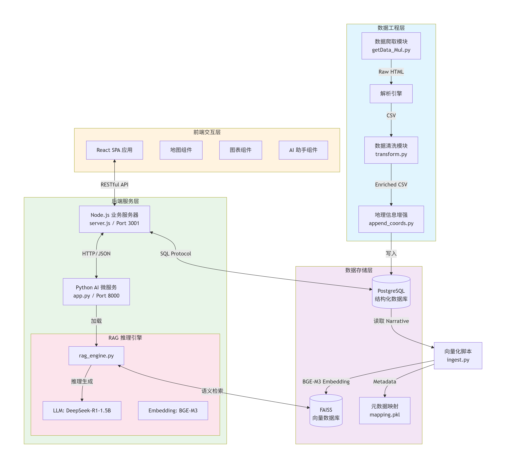
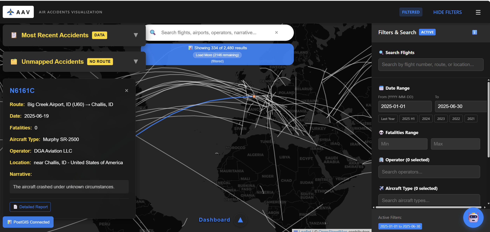
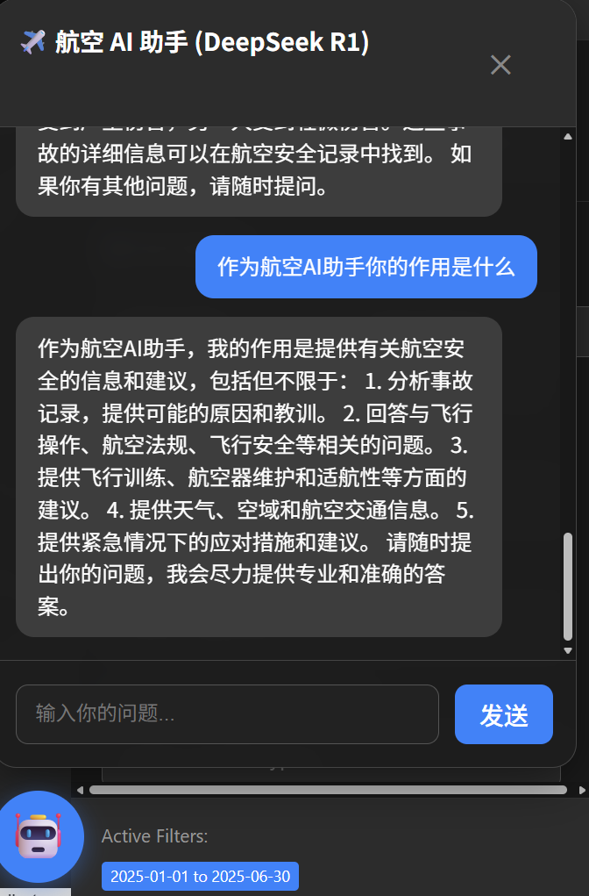
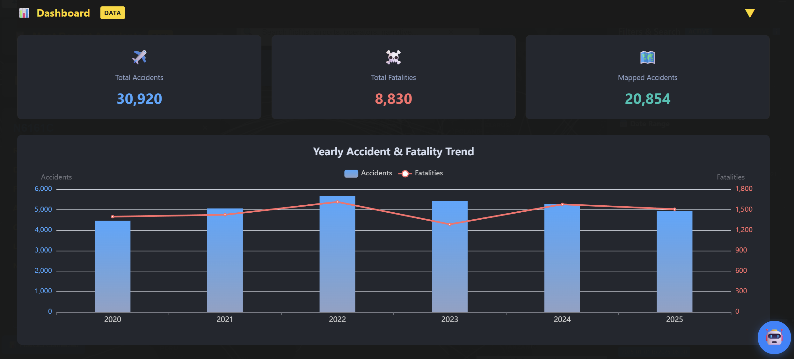
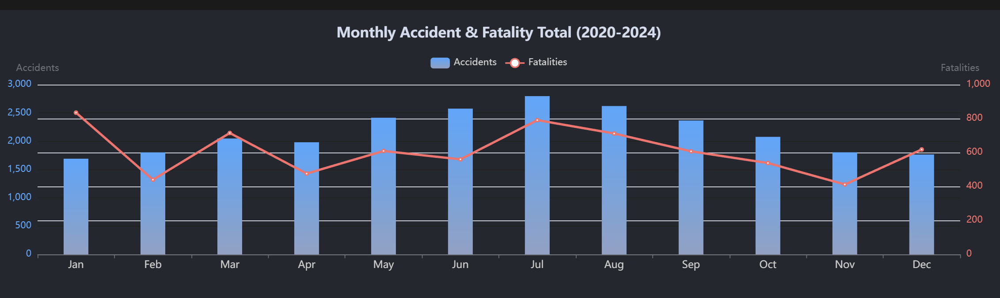
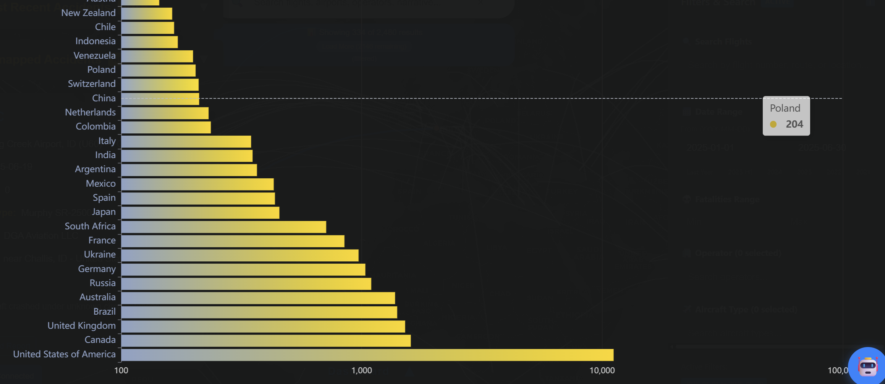
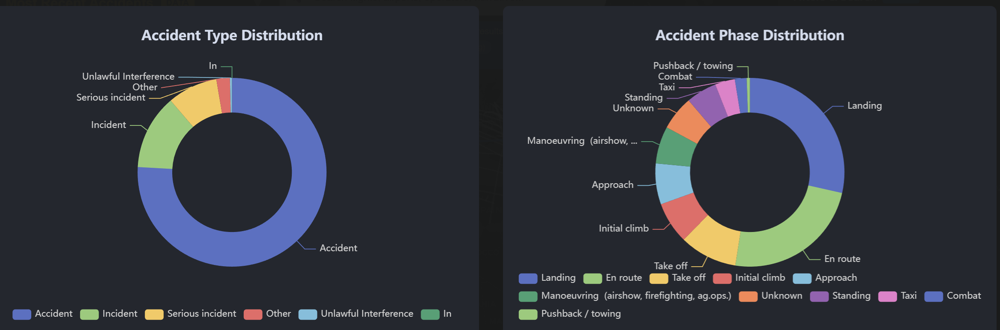
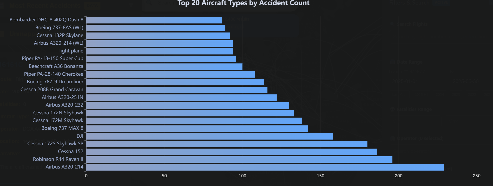
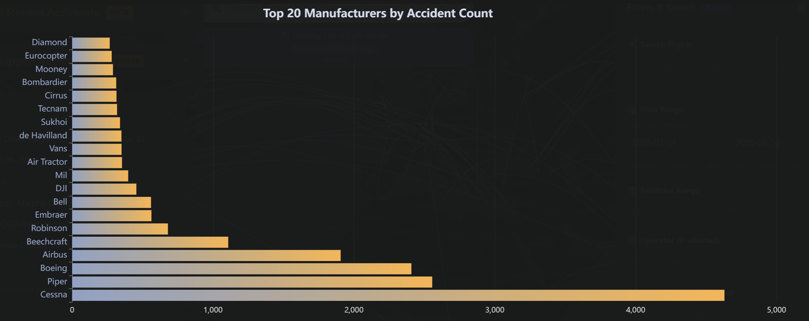
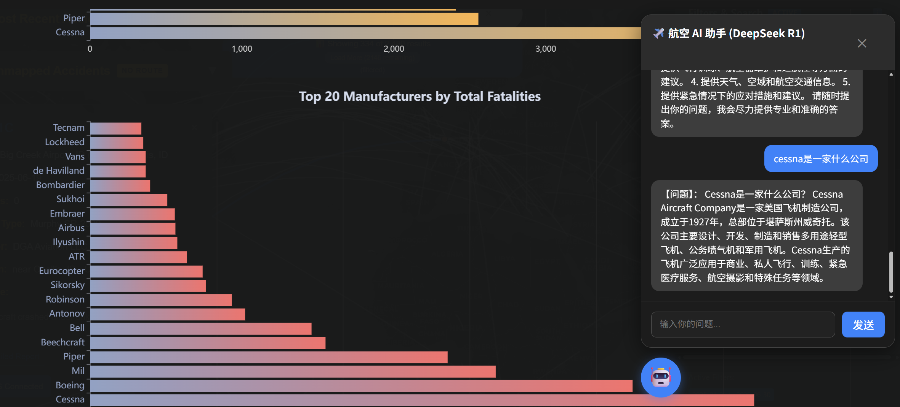

# 1. 项目概述与愿景

## 1.1 项目背景

随着全球航空业的快速发展，航空安全数据呈指数级增长。传统的航空事故数据库（如 ASN）虽然数据详实，但往往以静态网页或非结构化文本的形式存在，缺乏直观的可视化手段和深度的关联分析能力。研究人员和公众难以快速从海量文本中提取关键洞察，例如特定机型的故障模式或特定区域的事故趋势。**就在最近，MH370航班的搜寻工作再一次启动，这进一步激发了我想要推进这个项目的动力！**

## 1.2 项目目标

本项目旨在构建一个集数据采集、清洗、存储、可视化与智能问答于一体的综合性平台。系统不仅通过交互式地图和动态图表展示事故的时空分布，更创新性地引入了 **检索增强生成 (RAG)** 技术，构建了基于大语言模型 (LLM) 的 AI 智能助手。该助手能够理解自然语言提问，实时检索事故知识库，并生成基于事实的专业分析，从而实现从“被动查阅数据”到“主动智能交互”的范式转变。

# 2. 系统总体架构设计

本平台采用现代化的 **前后端分离** 与 **微服务** 混合架构。系统逻辑上分为数据工程层、核心业务层、AI 计算层和用户交互层。
```plaintext
air-accidents-vis/
├── airportdata/                # 第一阶段：数据工程（Data Engineering）
│   ├── getData_Mul.py          # 多线程爬虫：从 ASN 采集 3 万条原始事故数据
│   ├── append_coords.py        # 地理编码：匹配起降机场经纬度坐标
│   ├── transform.py            # 数据清洗：日期规范化、数值提取与缺失值处理
│   └── import_to_db.py         # 数据库装载：将清洗后的数据导入 PostgreSQL
│
├── ai_service/                 # 第二阶段：AI 推理微服务（AI Microservice）
│   ├── models/                 # 预训练模型仓库
│   │   ├── bge-m3/             # 向量嵌入模型（Embedding Model）
│   │   └── deepseek-ai/        # 核心语言模型（DeepSeek-R1-1.5B）
│   ├── vector_db/              # 语义索引存储
│   │   ├── accidents.index     # FAISS 向量索引文件
│   │   └── mapping.pkl         # 元数据映射文件（用于检索后的数据回溯）
│   ├── ingest.py               # 知识库构建脚本：离线计算并固化向量索引
│   ├── rag_engine.py           # 推理核心引擎：实现“检索+生成”的 RAG 逻辑
│   └── app.py                  # AI API 网关：基于 FastAPI 的高性能异步服务
│
├── backend/                    # 第三阶段：业务后端与网关（Backend Gateway）
│   ├── server.js               # Node.js 主服务：处理 SQL 查询及 AI 请求转发
│   └── .env                    # 环境配置文件：存储数据库凭证与端口信息
│
└── src/                        # 第四阶段：交互式前端（Interactive UI）
    ├── components/             # React 功能组件库
    │   ├── MapView.jsx         # 地图可视化：处理 Leaflet 地图与航线渲染
    │   ├── AIAgent.jsx         # AI 助手界面：实现与微服务的对话交互
    │   ├── Dashboard.jsx       # 侧边栏：管理多维筛选与搜索逻辑
    │   └── StatisticsBoard.jsx # 数据看板：集成 ECharts 统计图表
    ├── App.jsx                 # 全局入口：管理前端状态机与组件生命周期
    └── assets/                 # 静态资源：系统图标与多媒体素材
```
## 2.1 架构拓扑图

为了更清晰地展示各模块间的交互，特别是 AI Agent 如何融入现有体系，我绘制了下图所示的架构图。核心设计理念是 **“Node.js 作为业务网关，Python 作为计算核心”**。



## 2.2 核心数据流解析

1. **数据生产流**：爬虫获取原始数据 -> 清洗与地理编码 -> 存入 PostgreSQL。

2. **知识库构建流 (ETL)**：从 PostgreSQL 提取文本 -> 文本截断与清洗 -> 向量化 (Embedding) -> 构建 FAISS 索引。

3. **可视化查询流**：前端发起筛选请求 -> Node.js 解析参数 -> PostgreSQL 聚合查询 -> 返回 JSON 数据渲染。

4. **智能问答流**：
    
     用户提问 -> 前端发送至 Node.js。
    
	  Node.js 转发至 Python AI 服务。
    
     Python 服务进行向量检索 (RAG) -> LLM 生成回答 -> 返回结果。

# 3. 模块详细设计与实现

### 3.1 数据采集与处理模块 

数据是系统的基石。本项目构建了一套健壮的流水线，解决了数据源非结构化、反爬虫限制以及地理信息缺失等问题。

1. 高并发爬虫 (getData_Mul.py)

针对 ASN 网站的结构，我设计了基于 requests 和 BeautifulSoup 的多线程爬虫。为了应对服务器的反爬策略，核心函数 safe_get() 实现了指数退避算法（Exponential Backoff）：当请求失败时，程序会自动休眠并按指数级增加重试间隔。同时，通过构建 User-Agent 池和随机延迟机制，模拟真实用户行为，确保了 28000+ 条数据的高完整性抓取。

2. 地理空间数据增强 (append_coords.py)

原始事故数据仅包含机场名称或 IATA/ICAO 代码，无法直接上图。本模块引入了多级匹配策略：

 **一级匹配（精确）**：建立机场代码 Hash Map，通过 IATA/ICAO 代码实现 O(1) 复杂度的精确坐标查找。

 **二级匹配（模糊）**：对于仅有名称的通航机场，集成 `rapidfuzz` 库，采用 Levenshtein 距离算法计算字符串相似度。设定阈值（如 Score > 90）进行模糊匹配，有效解决了拼写差异导致的匹配失败问题。


3. 数据清洗与标准化 (transform.py)

针对 PostgreSQL 的强类型约束，清洗模块重点处理了以下异常：

 **时间标准化**：将自然语言日期（如 "July 8, 2024"）统一转换为 ISO-8601 标准格式 (`YYYY-MM-DD`)。

 **数值提取**：使用正则表达式从混合文本（如 "Fatalities: 160 / Occupants: 160"）中分离出确切的整型数值。

 **空值处理**：建立严格的空值映射策略，如将缺失的 `Aircraft damage` 统一标记为 `None`，确保数据库写入时的原子性。


## 3.2 核心数据库设计 (PostgreSQL)
系统选用 PostgreSQL 作为主数据库，表结构经过精心设计以容纳从非结构化网页中提取的多维信息。表名为 `asn_incidents`，主键选用 `DetailURL`，利用其作为事故详情页链接的唯一性，有效防止了数据重复录入。

**表结构定义 (Schema Definition)**

数据库字段设计充分考虑了数据的多样性，涵盖了事故标识、时空信息、航空器详情、伤亡统计、飞行状态以及增强的地理坐标数据。

|**字段类别**|**字段名 (Column)**|**类型 (Type)**|**说明 (Description)**|
|---|---|---|---|
|**唯一标识**|**DetailURL**|`TEXT`|**主键 (PK)**，事故详情页的 URL 链接，作为每条记录的唯一标识符。|
|**时空信息**|Date|`DATE`|事故发生的标准日期 (ISO 8601 格式)。|
||Time|`TEXT`|事故发生的具体时间（格式可能不统一，故存储为文本）。|
||Location|`TEXT`|事故发生地点的文字描述（如 "Near Paris"）。|
|**机场与航线**|Departure airport|`TEXT`|起飞机场名称。|
||Destination airport|`TEXT`|目的地机场名称。|
||dep_IATA / dep_ICAO|`TEXT`|起飞机场的 IATA 三字码和 ICAO 四字码。|
||arr_IATA / arr_ICAO|`TEXT`|目的地机场的 IATA 三字码和 ICAO 四字码。|
|**地理坐标**<br><br>  <br><br>|**dep_lat / dep_lon**|`FLOAT`|**清洗后生成的字段**，起飞机场的纬度和经度，用于地图航线绘制。|
||**arr_lat / arr_lon**|`FLOAT`|**清洗后生成的字段**，目的地机场的纬度和经度。|
|**航空器信息**|Type|`TEXT`|航空器完整型号 (如 "Boeing 737-800")。|
||Registration|`TEXT`|航空器注册号 (尾号)。|
||MSN|`TEXT`|制造商序列号 (Manufacturer Serial Number)。|
||Year of manufacture|`INTEGER`|航空器出厂年份。|
||Owner/operator|`TEXT`|航空公司或运营机构名称。|
|**事故详情**|**Narrative**|`TEXT`|**核心文本字段**，包含事故的详细经过与原因分析。这是 **RAG AI 引擎** 进行向量化检索的主要数据源。|
||Category|`TEXT`|事故分类代码 (如 A1, C2 等)。|
||Nature|`TEXT`|飞行性质 (如 "Passenger", "Cargo", "Military")。|
||Phase|`TEXT`|事故发生的飞行阶段 (如 "Landing", "En route")。|
||Aircraft damage|`TEXT`|飞机受损程度 (如 "Destroyed", "Substantial")。|
|**伤亡统计**|Fatalities|`INTEGER`|事故造成的死亡人数。|
||Occupants|`INTEGER`|机上总人数（乘客 + 机组）。|
||Other fatalities|`TEXT`|地面或其他非机上人员死亡情况描述。|
|**元数据**|Confidence Rating|`TEXT`|数据源的可信度评级。|
||Sources|`TEXT`|信息来源列表。|
||RevisionHistory|`TEXT`|该条记录的修订历史。|
||dep_CODE / arr_CODE|`TEXT`|原始数据中的机场混合代码字段。|

### 3.3 AI 微服务模块 

这是本项目最具技术含量的部分。为了实现本地化的智能分析，我构建了一个基于 Python 的微服务子系统。

**文件目录结构：**

```Plaintext
ai_service/
├── models/                     # 模型仓库
│   ├── bge-m3/                 # 语义向量模型 (Embedding)
│   └── deepseek-ai/            # 大语言模型 (LLM)
├── vector_db/                  # 向量数据库存储
│   ├── accidents.index         # FAISS 索引文件
│   └── mapping.pkl             # 元数据映射文件
├── app.py                      # FastAPI 网关入口
├── rag_engine.py               # RAG 推理核心引擎
├── ingest.py                   # 知识库构建脚本
└── requirements.txt            # 依赖清单
```

1. 向量知识库构建 (ingest.py)

该脚本负责将 PostgreSQL 中的非结构化数据转化为机器可理解的向量索引。

 **预处理策略**：读取数据库中的 `Narrative` 字段。为了防止长文本导致 Embedding 计算时的 $O(L^2)$ 复杂度爆炸及显存溢出，我采用了物理截断策略（限制前 500-800 字符），既保留了事故的核心原因（通常位于段首），又提升了计算效率。

 **向量化 (Embedding)**：加载 `BGE-M3` 模型。该模型支持多语言且语义表征能力极强。我将每条事故描述转化为 1024 维的稠密向量。

 **索引构建**：使用 **FAISS** 构建 `IndexFlatIP`。由于 BGE-M3 输出的向量已归一化，内积等同于余弦相似度，能够高效计算文本间的语义距离。


2. RAG 推理引擎 (rag_engine.py)

实现了单例模式的 AI 引擎，确保模型只加载一次，常驻显存。

 **混合检索逻辑**：

1. 接收用户查询，调用 Embedding 模型生成查询向量。

2. 在 FAISS 中进行近似最近邻搜索 (ANN)，获取 Top-K 最相似的向量 ID。

3. 通过 ID 在 `mapping.pkl` 中回溯到具体的事故时间、机型和描述文本。

 **Prompt Engineering**：采用 Structued Prompt 技术，将检索到的“已知信息”注入到 System Prompt 中，强制 LLM 仅基于检索结果回答，有效抑制了模型的“幻觉”现象。


3. API 网关 (app.py)

基于 FastAPI 框架，提供高性能的异步接口 /chat。

 **数据清洗层**：这是一个关键细节。由于 NumPy 的 `float32` 和 Python 的 `datetime` 对象无法被标准 JSON 序列化，我在返回结果前实现了一层序列化拦截器，将所有非标量数据强制转换为字符串，确保了与 Node.js 通信的稳定性。


### 3.4 后端业务网关 (Node.js + Express)

`server.js` 充当了整个系统的“指挥官”。它不仅负责传统的数据库 CRUD 操作，还承担了 **反向代理** 的角色。

 **API 聚合**：前端的所有请求统一发送至 `:3001` 端口，避免了前端处理复杂的跨域配置。

 **AI 请求转发**：当收到 `/api/chat` 请求时，Node.js 使用 `axios` 将请求透传给 Python 服务 (`:8000`)。这种设计使得 AI 服务的部署位置对前端透明，未来可以将 AI 服务迁移至 GPU 服务器而无需修改前端代码。

 **查询优化**：对于 `/api/statistics` 等高频统计接口，使用了 `Promise.all` 进行并发 SQL 查询，大幅降低了接口响应时间。


### 3.5 前端可视化交互 (React ecosystem)

前端应用基于 React 18 和 Vite 构建，强调组件化和响应式设计。

1. 交互式地图 (MapView.jsx)

基于 react-leaflet 开发。为了解决大圆航线在二维地图上的视觉畸变问题，实现了基于线性插值和正弦修正的航线绘制算法。每条航线由 60 个插值点构成，既保证了曲线的平滑度，又准确还原了航班的实际飞行路径。



2. 智能助手组件 (AIAgent.jsx)

为了提供流畅的对话体验，该组件实现了以下特性：

 **流式感 UI**：虽然目前后端是全量返回，但前端 UI 设计预留了 Loading 态和打字机效果的兼容性。

 **上下文溯源**：在 AI 的回答下方，动态渲染参考来源卡片。用户点击卡片即可跳转到对应的事故详情，增强了信息的可信度。

 **状态管理**：使用 `useRef` 管理滚动条位置，确保新消息自动滚动到底部；使用 `useState` 维护对话历史，保证组件重渲染时记录不丢失。



3. 数据看板 (Dashboard.jsx & StatisticsBoard.jsx)

集成了 ECharts，实现了多维数据的联动分析。图表组件与筛选条件通过 React 的 Context API 或 Props Drilling 进行状态同步。当用户在左侧面板调整“年份范围”时，右侧的“事故类型分布图”会实时触发重绘，展示特定时间段内的数据特征。

下图为 事故总数图（以年来统计）



下图为 事故总数图（以月来统计）



下图为 事故总数（按国家来统计）



下图为 事故类型和事故原因



下图为事故数前20的航空公司



下图为事故数前20的飞机制造商



下图为死亡数前20的飞机制造商



可以发现，Cessna这家公司，在事故数量和死亡人数上都很高。

为此，可以点击右边的 AI 助手，向他询问这是一家什么公司。得到的结果为，这是一家小型飞机制造商。


## 4. 技术栈总结

|**层次**|**技术选型**|**核心作用**|
|---|---|---|
|**语言**|Python 3.10+, JavaScript (ES6+)|全栈开发与数据处理|
|**前端**|React 18, Vite, Leaflet, ECharts|构建高性能、交互式的单页应用|
|**后端**|Node.js, Express, Axios|业务逻辑处理与服务编排|
|**AI 服务**|FastAPI, PyTorch, Transformers, FAISS|深度学习推理与向量检索服务|
|**模型**|DeepSeek-R1-1.5B, BGE-M3|文本生成与语义嵌入|
|**数据库**|PostgreSQL 12+|关系型数据存储与聚合分析|
|**爬虫**|Requests, BeautifulSoup, ThreadPool|高并发数据采集|
|**工具**|Postman, Git|接口测试与版本控制|

## 5. 项目亮点与工程价值

1. **工业级 RAG 落地实践**：不同于简单的 API 调用，本项目从零构建了包含 ETL、向量库索引、混合检索在内的完整 RAG 链路，解决了长文本截断、中英文路径兼容、JSON 序列化等实际工程问题。

2. **异构微服务架构**：成功整合了 Node.js 的高并发 IO 能力和 Python 的科学计算能力，通过 HTTP 协议实现进程间通信 (IPC)，为未来系统的水平扩展（如将 AI 模块独立部署到算力集群）打下了坚实基础。

3. **全链路数据闭环**：实现了从“原始网页数据”到“结构化数据库”，再到“向量知识库”的数据流转，保证了数据的一致性和可溯源性。

4. **极致的可视化体验**：不仅实现了地理信息的可视化，更通过 AI 赋予了数据“说话”的能力，用户不仅能看到事故发生的地点，还能通过对话了解事故背后的复杂成因。

# 6. 部署方案

本项目的部署流程分为数据初始化、AI 推理引擎准备、后端中枢启动以及前端界面呈现四个阶段。为了保证系统的稳定性，建议按照以下顺序依次执行。

## 6.1 环境预要求

在开始部署前，请确保环境已安装以下基础组件：

1. **数据库**：PostgreSQL 。

2. **运行环境**：Node.js (v18+)、Python (3.10+)、npm (v9+)。

3. **硬件建议**：建议配备支持 CUDA 的 NVIDIA 显卡（显存不少于 8GB），以获得最佳的 AI 推理体验。


---

## 6.2 数据流水线部署

数据流水线负责从原始网页抓取数据并将其转化为数据库中的结构化记录。请进入 `airportdata` 目录执行相关脚本。

**1. 原始数据爬取** 运行多线程爬虫脚本，从 ASN 网站获取事故原始信息并保存为 CSV 文件。


```Bash
cd ./airportdata
python getData_Mul.py
```

**2. 数据清洗与地理信息增强** 执行坐标匹配与数据转换脚本。该步骤将补全事故起降点的经纬度，并进行 ISO 日期标准化和数值格式化。


```Bash
python transform.py
python append_coords.py
```

**3. 数据导入数据库** 将处理完成的最终数据集导入 PostgreSQL 数据库。执行前请确保数据库服务已开启并创建了相应的库。


```Bash
python import_to_db.py
```

---

## 6.3 AI 微服务部署

AI 微服务是系统的智能核心，负责向量检索与大模型推理。部署前请确保已将模型文件放入 `models` 目录下。

**1. 依赖安装与向量库构建** 首先安装 Python 相关的深度学习与接口依赖，随后运行向量化脚本生成 FAISS 索引。

```Bash
pip install -r requirements.txt
cd ./ai_service
python ingest.py
```

**2. 启动 FastAPI 服务** 向量库构建完成后，启动 AI 接口网关。该服务默认监听 8000 端口。


```Bash
python app.py
```

---

## 6.4 业务后端部署 

后端服务作为整个系统的调度中枢，负责处理业务逻辑并转发 AI 请求。

**1. 依赖安装与配置** 进入后端目录，安装 Node.js 依赖包。请确保已在 `.env` 文件中正确配置了数据库连接信息。

```Bash
cd ./backend
npm install
```

**2. 服务启动** 启动 Express 服务器。该服务默认监听 3001 端口。

```Bash
npm start
```

---

## 6.5 前端可视化应用部署 

前端应用是用户交互的入口。您可以根据需求选择开发模式或正式生产环境部署。

**1. 依赖安装** 在项目根目录下安装 React 及其相关可视化组件依赖。

```Bash
npm install
```

**2. 环境启动** 

```Bash
npm run dev
```

---

## 6.6 系统检查与验收

全链路启动后，可以通过以下步骤进行验收：

1. **数据校验**：访问地图页面，检查航线是否能够正常渲染，这标志着 PostgreSQL 数据库与经纬度处理正常。

2. **AI 联调**：点击右下角 AI 助手图标并提问。如果 Node.js 控制台打印了转发日志，且 Python 控制台显示了向量检索过程并最终返回回答，则标志着微服务链路打通。

3. **统计验证**：唤起下方数据看板，检查各维度 ECharts 图表是否能正确展示汇总后的 3 万条事故统计信息。

# 7. 项目小结与收获

这个项目诞生于对海量非结构化数据进行可视化与智能化探索的愿望。不仅仅构建了一个展示数据的网页，更是搭建了一套完整的数据工程流水线。数据源自 **Aviation Safety Network**，涵盖了从 2021 年到 2025 年间发生的 **30,000 余条** 事故记录。为了让这些数据“活”起来，我编写了具备指数退避重试机制的多线程爬虫，并利用 **rapidfuzz** 模糊匹配算法补全了数万条事故的起降点坐标，最终将这些信息沉淀在 **PostgreSQL** 数据库中。

在架构设计上，我没有选择简单的单体结构，而是采用了“**业务网关 + AI 微服务**”的解耦方案。**Node.js (Express)** 作为业务中枢，负责处理高并发的地图筛选和统计请求；而沉重的 AI 计算则交由 **Python (FastAPI)** 独立运行。这种架构让系统显得非常稳健：前端 React 应用通过 Node.js 转发指令，Node.js 再与 Python 通信，为未来将 AI 模块迁移到高性能显卡服务器打下了基础。

项目最核心的突破在于引入了基于 **RAG** 技术的 **AI Agent**。我利用 **BGE-M3** 模型对事故描述进行了向量化处理，并构建了本地 **FAISS** 向量数据库。当用户提问时，系统会先在向量空间中检索最相关的事故片段，再交给本地部署的 **DeepSeek-R1-7B** 模型进行汇总，用户不仅能在地图上看到事故的分布，更能直接用自然语言询问某次事故的深层原因，实现了真正的语义化检索。

通过这次大作业，通过这门课程，我充分练习了 爬虫、数据分析与可视化、前后端交互和Agent构建，可以说把过去所学所得在这门课上，都用上啦，形成了一个从获取数据、分析数据、应用数据的闭环。

在此，衷心感谢**任课老师胡老师和助教老师邱老师**的大力支持和帮助！！我将继续在工程领域中不断精进，不断成长！


