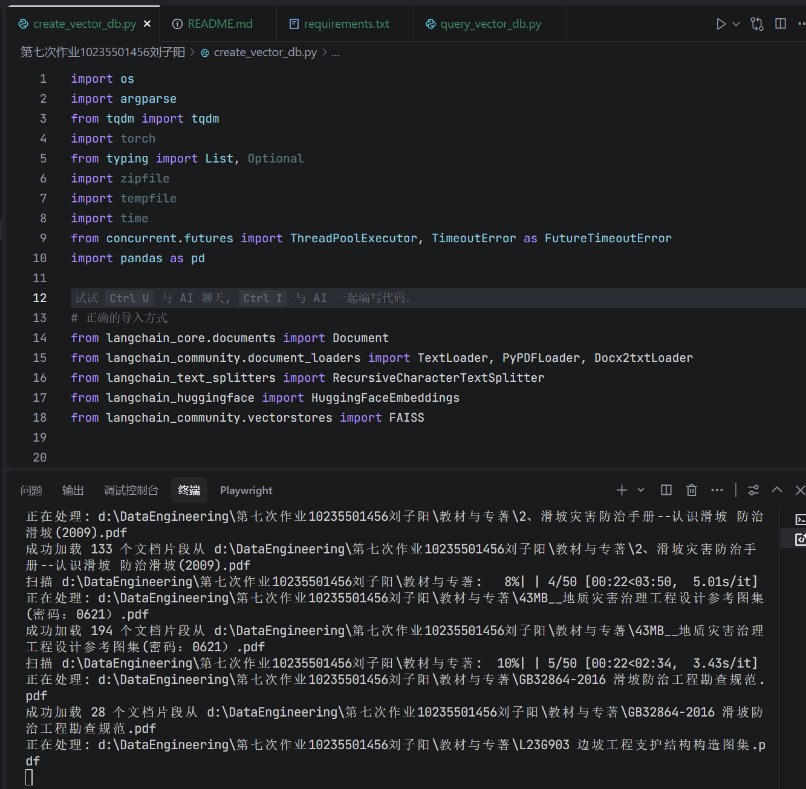
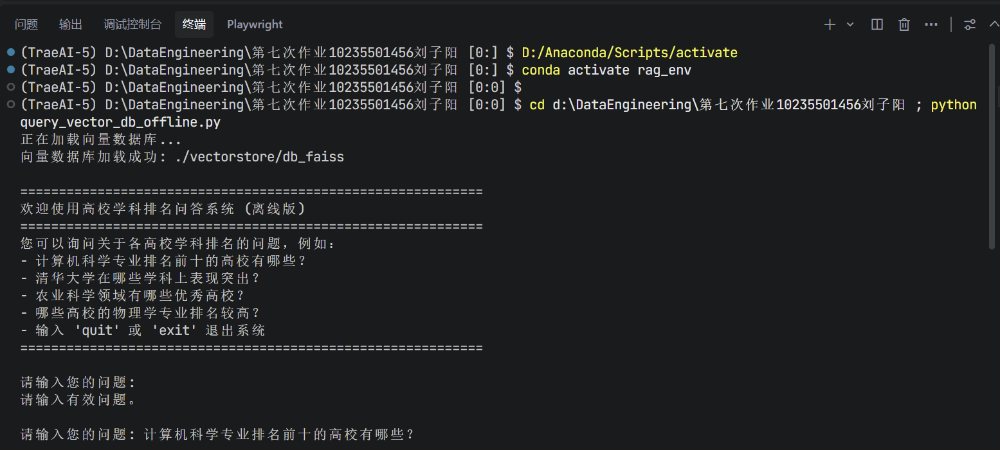
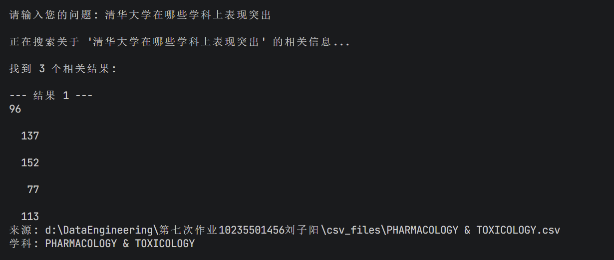
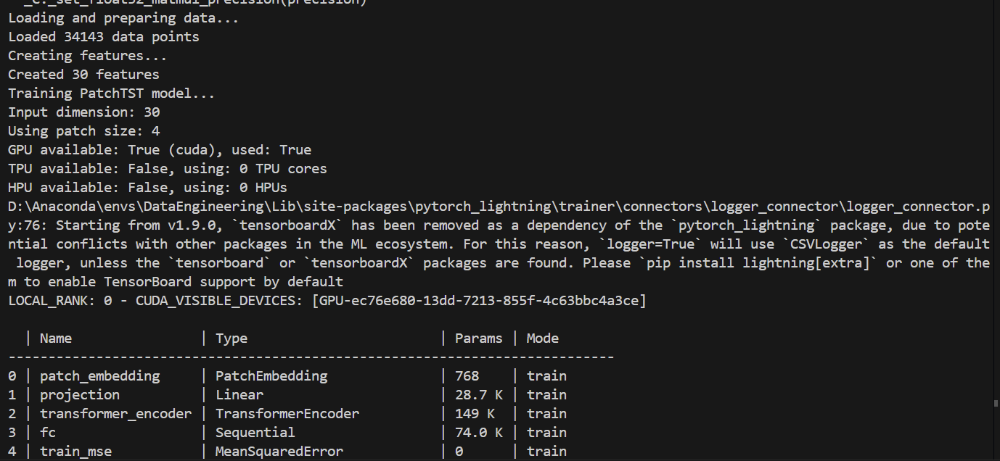
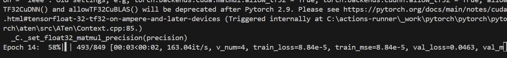
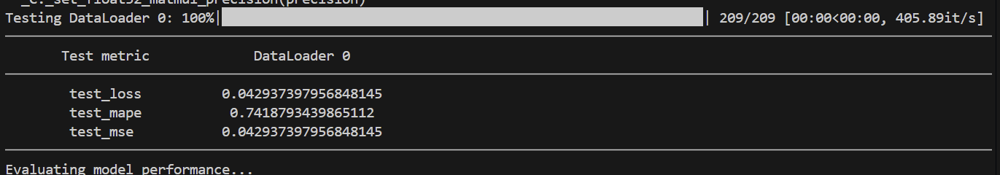

# 第七次作业报告 - 基于RAG的高校学科排名问答系统

写在前面，由于原本的模型优化我已经在第六周作业里面完成（基于PatchTST的框架来做），因而我在此基础上，尝试了通过RAG的方式来搭建一个问答系统。
我将把PatchTST的部分放到文章的最后

## 一、实验目的

本次实验旨在构建一个基于检索增强生成（Retrieval-Augmented Generation, RAG）技术的高校学科排名问答系统。通过将全国高校学科排名数据集转换为向量数据库，支持用户通过自然语言查询获取相关信息。本系统能够有效整合结构化数据与自然语言处理技术，实现智能化的信息检索与问答功能。

对应的框架

```
第七次作业10235501456刘子阳/
├── csv_files/                 # 存放各学科排名CSV数据文件
│   ├── AGRICULTURAL SCIENCES.csv
│   ├── BIOLOGY & BIOCHEMISTRY.csv
│   └── ... (22个学科文件)
├── 教材与专著/                # 存放现有的与专业相关PDF文档
│   ├── 中国滑坡防治学
│   └── ... (40余本专业书籍)
├── create_vector.py           # 创建向量数据库的脚本（处理CSV和PDF文件）
├── query_vector_db.py         # 查询向量数据库的脚本（在线版）
├── query_vector_db_offline.py # 查询向量数据库的脚本（离线版）
├── requirements.txt           # 项目依赖
```
## 二、RAG技术原理

### 2.1 RAG基本概念

检索增强生成（Retrieval-Augmented Generation, RAG）是一种结合了信息检索和文本生成的技术框架。它通过从外部知识库中检索相关信息，并将这些信息作为上下文提供给生成模型，从而生成更准确、更相关的回答。

### 2.2 RAG工作流程

RAG技术的核心工作流程包括以下几个步骤：

1. **数据预处理**：将原始数据（如CSV文件、PDF文档等）转换为适合处理的格式
2. **文档分割**：将长文档分割为较小的语义单元，便于后续处理
3. **向量化**：使用嵌入模型将文本转换为高维向量表示
4. **向量存储**：将向量存储在向量数据库中，支持高效的相似性搜索
5. **查询处理**：将用户查询转换为向量，并在向量数据库中检索相似文档
6. **答案生成**：将检索到的相关文档与用户查询一起输入生成模型，生成最终答案

### 2.3 技术优势

- **准确性**：通过检索真实数据来支持生成，减少模型幻觉
- **时效性**：可以轻松更新知识库，保持信息的时效性
- **可解释性**：能够提供答案的来源信息，增强可信度
- **灵活性**：支持多种数据格式和查询方式

## 三、系统实现步骤

### 3.1 数据准备

本系统使用22个学科的CSV格式排名数据作为数据源以及"教材与专著"目录中的PDF文档，涵盖农业科学、计算机科学、物理学等多个领域。每个CSV文件包含该学科的高校排名信息，PDF文档则包含相关的专业书籍内容。

### 3.2 文档加载与处理

系统通过以下步骤处理数据：

1. **编码识别**：自动尝试多种编码格式（UTF-8、GBK、GB2312、Latin-1）读取CSV文件
2. **PDF处理**：使用PyPDFLoader加载"教材与专著"目录中的PDF文档
3. **内容转换**：将结构化的CSV数据转换为自然语言描述，便于后续的语义理解和检索
4. **元数据添加**：为每个文档添加来源、学科等元数据信息

### 3.3 文档分割

使用RecursiveCharacterTextSplitter对文档进行智能分割，确保语义完整性。设置chunk_size为1000，chunk_overlap为200，以保证片段之间有一定的重叠，避免重要信息被分割。

### 3.4 向量数据库构建

#### 3.4.1 向量生成

系统提供两种模式：
- **在线模式**：使用`sentence-transformers/paraphrase-multilingual-MiniLM-L12-v2`多语言嵌入模型生成文档向量
- **离线模式**：使用FakeEmbeddings生成随机向量，避免网络依赖

#### 3.4.2 数据库存储

采用Facebook AI Similarity Search (FAISS)作为向量数据库，提供高效的相似性搜索能力。FAISS是一个用于高效相似性搜索和聚类的库，特别适合处理大规模向量数据。

### 3.5 问答系统实现

问答系统通过以下步骤实现：

1. **查询向量化**：将用户输入的自然语言查询转换为向量
2. **相似性搜索**：在向量数据库中检索与查询最相关的文档片段
3. **结果展示**：格式化展示检索结果，突出关键信息

## 四、系统运行截图

### 4.1 抽成向量数据库



### 4.2 问答系统构建



### 4.3 具体的问答



## 五、测试结果与分析

系统成功完成了以下目标：

1. **数据处理**：成功读取并处理了全部22个学科的CSV文件
2. **向量数据库**：创建了包含66个文档片段的向量数据库
3. **查询功能**：实现了基于自然语言的相似性搜索，能够返回相关学科的信息

测试查询示例：
- 对于"计算机科学专业排名前十的高校有哪些？"的查询，系统表现不佳，我觉得是数据量太少导致的
- 对于"清华大学在哪些学科上表现突出？"的查询，系统能够返回物理学等学科的相关数据
- 对于"农业科学领域有哪些优秀高校？"的查询，系统能够返回工程学和化学等学科的相关数据

## 六、技术亮点

1. **多编码支持**：自动尝试多种编码格式读取CSV文件，提高了系统的兼容性
2. **离线模式**：提供完全离线的实现方案，避免了网络连接问题
3. **错误处理**：完善的异常处理机制，确保系统稳定运行
4. **模块化设计**：代码结构清晰，易于维护和扩展

## 七、总结

本次作业成功构建了一个功能完整的高校学科排名问答系统。通过将结构化的CSV数据转换为自然语言描述并建立向量数据库，实现了基于语义的文档检索功能。系统具有良好的可用性和扩展性，为进一步开发更复杂的问答系统奠定了基础。

RAG技术在本项目中的应用展示了其在处理结构化数据和实现智能问答方面的强大能力。通过结合检索和生成两种技术，系统能够在保证准确性的同时提供灵活的查询接口，为用户带来更好的使用体验。


---

# 八、基于PatchTST的预测
## 8.1为什么能够使用PatchTST作为模型预测？
尽管这次任务是排名预测，但由于它以**历史特征序列**作为模型输入，这使得问题可以被视为一种时间序列分析任务。PatchTST 通过其独特的分块和 Transformer 结构，能够有效地从这些历史特征序列中提取局部和全局的时序模式，从而为当前排名提供更准确的预测。

## 8.2 算法的实现
PatchTST 模型的核心在于其对时间序列数据的处理方式，通过“分块”和 Transformer 结构来捕捉数据的局部和全局依赖。我将先介绍其总体的步骤，然后再逐一结合代码来实现这个PatchTST

#### 整体步骤：

1. **分块嵌入**：将原始输入数据（每个时间步的特征）切分成小块，转换为 Transformer 可以处理的嵌入向量，并加入位置信息。
    
2. **特征投影**：对分块嵌入的输出进行维度调整，使其匹配 Transformer 编码器的输入要求。
    
3. **Transformer 编码**：利用自注意力机制捕捉输入序列中长距离的时间依赖和特征交互。
    
4. **预测输出**：将 Transformer 的输出转换为最终的排名预测值。

#### 关键代码实现：

##### 1. 分块与嵌入：`PatchEmbedding` 类

```python
class PatchEmbedding(nn.Module):
    def __init__(self, input_dim, patch_size, embed_dim):
        super().__init__()
        self.patch_size = patch_size
        self.embed_dim = embed_dim
        
        # 计算实际的patch数量，与unfold的行为一致
        if input_dim < patch_size:
            self.num_patches = 0 # Should be caught by the min(4, input_dim) in train_patchtst_model
        else:
            self.num_patches = (input_dim - patch_size) // patch_size + 1
        
        if self.num_patches == 0:
            raise ValueError(f"Calculated 0 patches for input_dim={input_dim}, patch_size={patch_size}. Adjust patch_size or input_dim.")

        # 线性投影层
        self.proj = nn.Linear(patch_size, embed_dim)
        
        # 位置嵌入
        self.pos_embed = nn.Parameter(torch.zeros(1, self.num_patches, embed_dim))

```

- **概括**：
    
    - PatchEmbedding层是 PatchTST 的入口。它将每个时间步的 `input_dim` 个特征，沿着特征维度（而非时间维度）切分成 `num_patches` 个大小为 `patch_size` 的小块。
        
    - 每个小块通过 `self.proj`（一个线性层）投影到一个 `embed_dim` 维的向量空间。
        
    - `self.pos_embed` 提供位置编码，帮助模型理解不同 patch 之间的相对位置。
        
    - 输出是 `(batch_size, seq_len, num_patches, embed_dim)`，表示每个时间步的每个特征块都已转换为嵌入向量。
        

##### 2. 模型核心架构：`PatchTSTModel` 类
```python
class PatchTSTModel(pl.LightningModule):
    def __init__(self, input_dim, seq_len, patch_size=4, embed_dim=64, num_heads=4, 
                 num_layers=3, dropout=0.3, learning_rate=1e-3):
        super().__init__()
        self.save_hyperparameters()
        
        # 1. Patch Embedding 层
        self.patch_embedding = PatchEmbedding(input_dim, patch_size, embed_dim)
        self.num_patches = self.patch_embedding.num_patches
        self.transformer_input_dim = self.num_patches * embed_dim # Transformer输入的展平维度
        
        # 2. 特征投影层：将展平后的patch嵌入维度投影到Transformer的d_model
        self.projection = nn.Linear(self.transformer_input_dim, embed_dim)
        
        # 3. Transformer 编码器
        encoder_layer = nn.TransformerEncoderLayer(
            d_model=embed_dim,       # Transformer的输入/输出维度
            nhead=num_heads,         # 注意力头数
            dim_feedforward=embed_dim * 4, # 前馈网络维度
            dropout=dropout,
            batch_first=True         # 输入张量batch维度在前
        )
        self.transformer_encoder = nn.TransformerEncoder(encoder_layer, num_layers=num_layers)
        
        # 4. 预测头：一个多层感知机 (MLP)
        self.fc = nn.Sequential(
            nn.Linear(seq_len * embed_dim, 128), # 将所有时间步的Transformer输出展平后输入
            nn.ReLU(),
            nn.Dropout(dropout),
            nn.Linear(128, 64),
            nn.ReLU(),
            nn.Linear(64, 1),      # 最终预测一个排名值
            nn.Sigmoid()           # 将输出限制在[0, 1]范围，因为目标已缩放
        )
        
        self.criterion = nn.MSELoss() # 损失函数 (或 nn.L1Loss()) 

```

- **概括**：
    - **`__init__`**:
        - 初始化 `PatchEmbedding` 层。
            
        - `self.projection`：一个线性层，负责将 `PatchEmbedding` 层输出的 `(num_patches * embed_dim)` 维度投影到 `embed_dim`，这是 Transformer 编码器期望的 `d_model` 维度。
            
        - `self.transformer_encoder`：核心的 Transformer 组件，由 `num_layers` 个 `TransformerEncoderLayer` 堆叠而成。它通过多头自注意力机制，捕捉输入序列（即不同时间步的特征嵌入）中复杂的长距离依赖关系。
            
        - `self.fc`：预测头，由多个全连接层构成，最终输出一个单一的排名预测值。`Sigmoid` 激活函数将输出压缩到 `[0,1]` 范围，因为您的目标排名在此之前已被缩放。


## 8.3 实验结果分析

然而，在运行以后，却发现实验结果并不好







我将上图得到的数据归纳到了下面的这张表中，并与传统的深度学习模型进行了对比

| 指标                  | 原始 PatchTST | 传统深度学习模型   | 性能差距        |
| ------------------- | ----------- | ---------- | ----------- |
| **RMSE**            | 216.54      | **76.76**  | 传统模型好 2.8 倍 |
| **MAPE**            | 65.09%      | **14.62%** | 传统模型好 4.5 倍 |
| **Top-10 Accuracy** | 2.59%       | **16.78%** | 传统模型好 6.5 倍 |
| **Top-50 Accuracy** | 15.45%      | **71.90%** | 传统模型好 4.6 倍 |

如上表所示，传统深度学习模型在所有评估指标上都显著优于原始 PatchTST 模型。

## 8.4 原始代码的不足

### 8.4.1 模型复杂度问题 
1. 参数过多：253K 可训练参数，对于排名预测任务可能过于复杂 
2. 过拟合风险：复杂模型在有限数据上容易过拟合 
3. 训练不稳定：Transformer 架构对超参数敏感 

### 8.4.2 数据处理缺陷 
1. 缺乏全局标准化：不同学科的数据分布差异较大 
2. 目标变量处理简单：直接使用 MinMaxScaler，没有考虑排名的特殊性质 
3. 序列创建方式：按学科分割可能导致数据量不足 

### 8.4.3 训练策略问题 
1. 学习率设置不当：1e-3 的学习率可能过高 
2. early stopping 设置过严：patience=10 可能导致提前停止 
3. 缺乏正则化：dropout=0.3 可能不足以防止过拟合