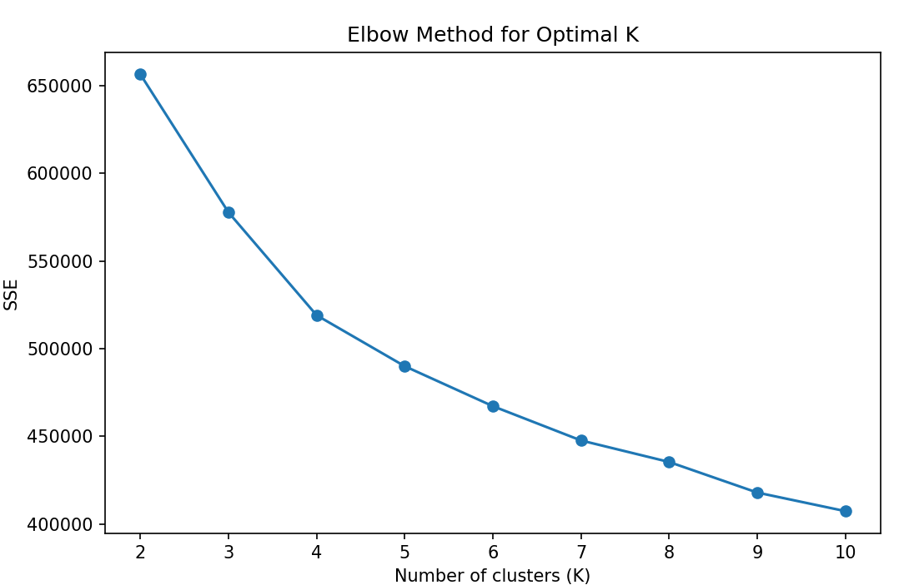
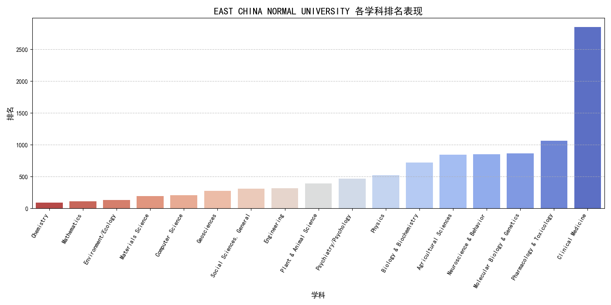
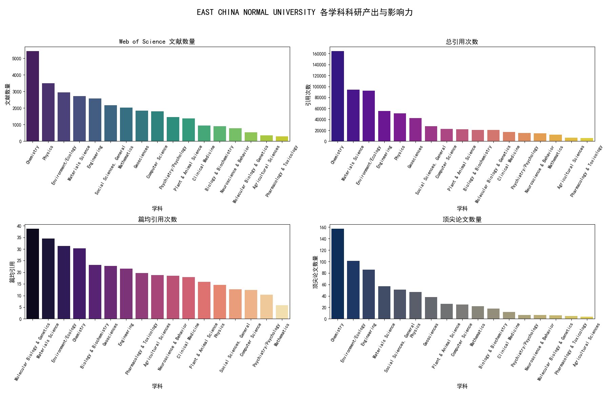
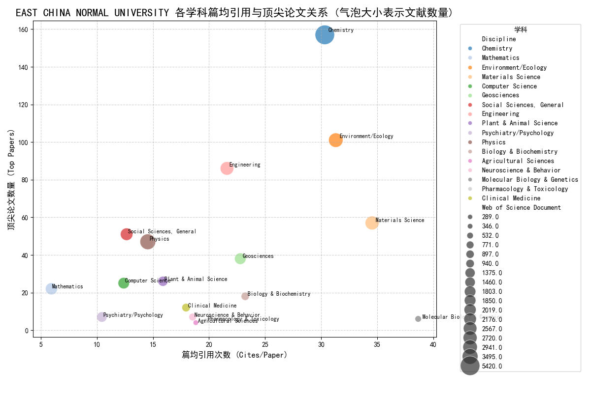
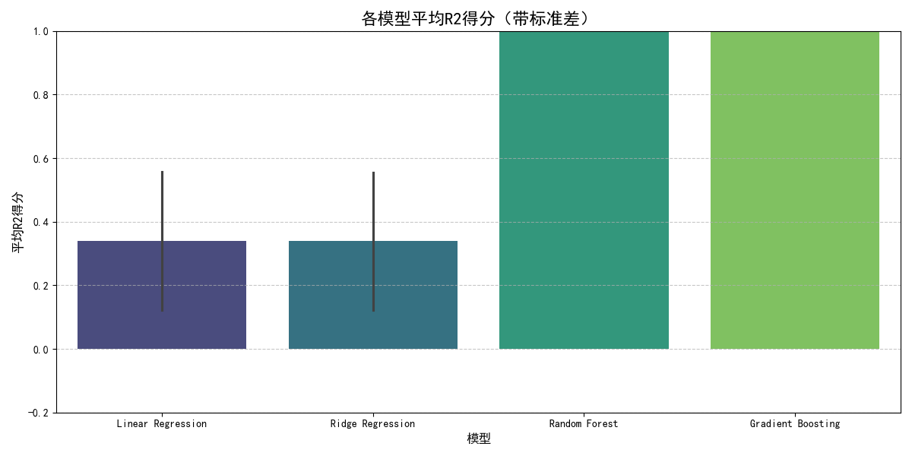
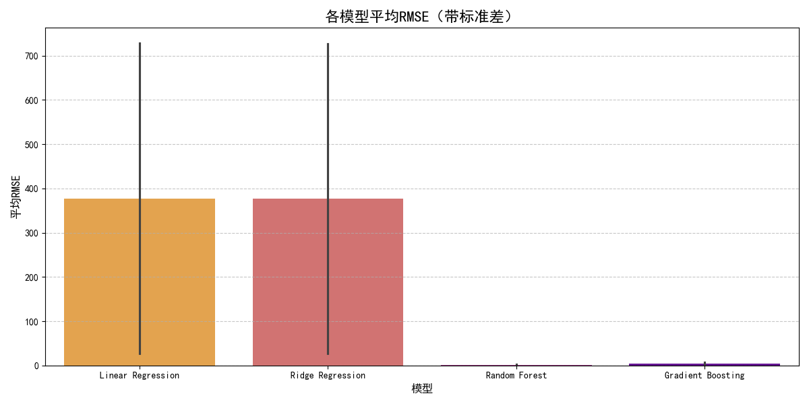
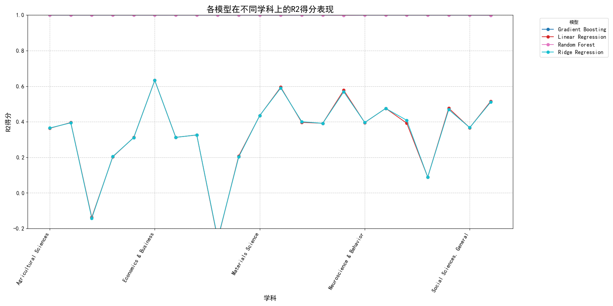

# 实验报告：全球高校学科排名数据分析
# 1. 引言

随着全球化进程的加速，高等教育机构间的竞争日益激烈，对高校进行科学合理的评估和定位对于其战略发展至关重要。本实验通过先前实验得到的22个学科数据集，运用聚类分析识别高校群体的特征，并通过探索性数据分析（EDA）对华东师范大学进行学科画像，最终构建学科排名预测模型。

# 2. Part1: 聚类分析：全球高校分类与相似高校识别

本部分旨在通过聚类分析，将全球高校根据其在22个学科的科研表现划分为不同的群体，并在此基础上识别与华东师范大学（EAST CHINA NORMAL UNIVERSITY）科研模式相似的高校。

## 2.1 数据准备与预处理

1. 数据读取与整合： 从第三次作业data&processed_data读取了22个学科的CSV文件。这些文件包括IndicatorsExport_processed.csv和IndicatorsExport (1)_processed.csv到IndicatorsExport (21)_processed.csv。为了准确地将文件内容与其对应的学科名称关联，我建立了精确的学科映射：索引0对应"Agricultural Sciences"，索引21对应"Space Science"等。

2. 特征提取与数值转换： 提取各高校在每个学科的Rank、Institutions、Countries/Regions、Web of Science Document、Cites、Cites/Paper和Top Papers。为了确保数值型数据能够被正确处理，所有包含数值信息的列在转换为数值类型前，都进行了字符串处理（移除逗号），并使用errors='coerce'将无法转换的值设为缺失值（NaN）。

3. 缺失值处理与数据整合： 对于在特定学科中大学名称（Institutions）缺失的记录，予以跳过。在所有学科数据整合后，对于大学在某些学科没有数据的情况，相关指标被填充为0，表示在该学科无产出。

4. 数据标准化： 考虑到不同科研指标（如文档数量和引用次数）之间巨大的数值范围差异，为了避免数值大的指标在聚类时权重过高，我对所有用于聚类的特征（Web of Science Document、Cites、Cites/Paper、Top Papers及其对应的学科维度特征）进行了StandardScaler标准化处理，使其均值为0、方差为1。

## 2.2 确定最佳聚类数量 K

为了确定 K-Means 聚类算法的最佳聚类数量 K，我采用了肘部法则（Elbow Method）的评估方法。

肘部法则（Elbow Method）：

通过绘制不同 K 值对应的簇内平方和（SSE）曲线图，可以观察到在 K 值增加到约4时，SSE 的下降速度开始显著放缓，曲线呈现出一个“肘部”。这表明进一步增加聚类数量对降低簇内离散度的边际效益递减。

如图1所示，虽然 K=2 时轮廓系数最高，但在实际应用中，我还综合考虑并结合对高校分类的实际需求，我最终选择了 K=4 作为最优聚类数量。

## 2.3 全球高校分类结果分析

采用 K-Means 算法（K=4）对标准化后的高校数据进行聚类，将全球高校划分为4个 distinct 的类别。下表展示了各类别高校在各个学科的平均指标概况：

表1：各聚类（Cluster）高校平均科研指标概况

|Cluster|Agricultural Sciences_Documents|Agricultural Sciences_Cites|Agricultural Sciences_Cites/Paper|...|Space Science_Cites|Space Science_Cites/Paper|Space Science_Top Papers|
|:--|:--|:--|:--|:--|:--|:--|:--|
|**0**|54.903621|921.680937|1.798705|...|799.537806|0.318691|0.726837|
|**1**|8649.666667|181027.000000|20.656667|...|559294.666667|30.643333|455.666667|
|**2**|925.084479|18098.573674|16.265953|...|23329.058939|9.487112|21.308448|
|**3**|1513.181818|30733.170455|20.845795|...|109325.545455|29.939091|104.931818|

各类别高校特点分析：

**Cluster 0 (基础研究/新兴或非活跃型大学)** 

该类别高校在所有学科的各项科研指标（文档数量、引用次数、篇均引用、顶尖论文）的平均值均非常低。这表明它们可能是在该排名体系中科研产出和影响力不显著的机构，或是其主要研究方向不在这些学科，也可能代表处于发展初期的大学。

**Cluster 1 (世界顶尖研究型大学/机构)** 

此类别高校在所有指标上均表现出极高的平均值，尤其在总引用次数、篇均引用和顶尖论文数量方面达到最高水平。这代表了全球范围内少数最顶尖、最全面、最具影响力的研究型大学或大型科研机构。

**Cluster 2 (国家/区域性骨干研究型大学)** 

华东师范大学即属于此类别。该群体高校的各项指标平均值居于中等偏上水平，显著高于Cluster 0，但低于Cluster 1和Cluster 3。其篇均引用和顶尖论文数量具有一定的竞争力。这包含了众多在国家或区域层面具有重要地位的综合性大学、师范类大学或专业性重点院校，是所在地区高等教育和科研体系的核心力量。

**Cluster 3 (高质量研究型大学)**

该类别高校在篇均引用和顶尖论文数量方面表现出色，平均值与Cluster 1接近，但总文档和引用量略低于Cluster 1。这可能代表了一批注重研究质量而非仅仅数量的大学，其在活跃学科领域内的论文质量、影响力及顶尖研究成果产出非常突出

### 2.3.1 与华东师范大学类似的高校

华东师范大学（EAST CHINA NORMAL UNIVERSITY）被成功归类到 **Cluster 2**。这符合其作为一所国内一流、具有显著影响力的综合性师范大学的地位。

在同一个 Cluster 2 中，与华东师范大学在科研产出和影响力模式上相似的高校列表非常广泛，其中包括了许多国内外知名大学，例如：

- **国内高校：** 南京农业大学、北京师范大学、南京师范大学、武汉大学、南京大学、郑州大学等。
    
- **国际高校：** 伊利诺伊大学厄巴纳-香槟分校、密歇根州立大学、柏林工业大学、巴斯克地区大学、奥斯陆大学、墨尔本皇家理工大学、都柏林大学学院等。
    

### 2.3.2 与华东师范大学最相似的五所大学
进一步地，通过计算欧氏距离，识别出了在 Cluster 2 中与华东师范大学最相似的5所大学：

1. **NANJING NORMAL UNIVERSITY (南京师范大学)**
    
2. **UNIVERSITY OF BASQUE COUNTRY (巴斯克地区大学)**
    
3. **LANZHOU UNIVERSITY (兰州大学)**
    
4. **TECHNICAL UNIVERSITY OF BERLIN (柏林工业大学)**
    
5. **SOUTHERN UNIVERSITY OF SCIENCE & TECHNOLOGY (南方科技大学)**

南京师范大学作为另一所国内顶尖师范类大学，与华东师范大学在学科结构和发展方向上具有高度相似性，因此被列为最相似的大学，这验证了聚类结果的有效性和合理性。其他如兰州大学、南方科技大学等国内大学，以及巴斯克地区大学、柏林工业大学等国际大学，也在整体科研模式上与华东师范大学表现出较高的相似度。

### 2.3.3 小结

本部分成功地通过聚类分析将全球高校划分为四种主要类型，每种类型都反映了不同的科研产出和影响力模式。华东师范大学被归类为“国家/区域性骨干研究型大学”，该类别包含大量国内外知名综合性大学和重点专业院校。通过深入分析，确定了南京师范大学等高校与华东师范大学在学术概况上具有最高的相似度，为理解华东师范大学在全球高等教育格局中的定位提供了数据支持。

# 3. 探索性数据分析 (EDA)：华东师范大学学科画像

本部分通过多角度的探索性数据分析（EDA），旨在为华东师范大学（EAST CHINA NORMAL UNIVERSITY）构建全面的学科画像，识别其优势、劣势、特色领域及其与全球平均水平的相对位置。

## **3.1 华东师范大学整体学科覆盖与表现**

首先，对华东师范大学在22个学科排名体系中的参与度和整体情况进行概览：

- **排名覆盖度：** 华东师范大学在22个学科中，有 **17** 个学科有排名。
    
- **有排名的学科列表：** Agricultural Sciences, Biology & Biochemistry, Chemistry, Clinical Medicine, Computer Science, Engineering, Environment/Ecology, Geosciences, Materials Science, Mathematics, Molecular Biology & Genetics, Neuroscience & Behavior, Pharmacology & Toxicology, Physics, Plant & Animal Science, Psychiatry/Psychology, Social Sciences, General。
    
- **没有排名的学科列表：** Economics & Business, Immunology, Microbiology, Multidisciplinary, Space Science。
    

这表明华东师范大学在绝大多数学科领域都具有一定的国际影响力，能够进入全球排名体系。同时，有5个学科目前未进入该排名，可能属于其非主要研究方向或仍有待发展的领域。

## **3.2 学科排名表现可视化**

通过可视化华东师范大学各学科的排名，可以直观地识别其强势学科。

- **图2：华东师范大学各学科排名表现**  

**分析：** 从图2可以看出，华东师范大学在 **Chemistry（化学，排名90）** 领域表现尤为突出，是唯一进入全球前100的学科。（可能因为我们校长是化学领域的，还是院士）此外，**Mathematics（数学，排名115）** 和 **Environment/Ecology（环境/生态学，排名130）** 也表现强劲，处于全球前150。**Materials Science（材料科学，排名196）**、**Computer Science（计算机科学，排名207）** 和 **Geosciences（地球科学，排名275）** 也位于全球前300。这些学科构成了华东师范大学的核心优势领域。相对而言，**Clinical Medicine（临床医学，排名2852）** 和 **Pharmacology & Toxicology（药理学与毒理学，排名1064）** 的排名显著靠后，显示出较大的提升空间。

## **3.3 各学科科研产出与影响力**

进一步细致考察华东师范大学各学科在科研产出（Web of Science 文献数量）和影响力（总引用次数、篇均引用次数、顶尖论文数量）上的具体表现。

- **图3：华东师范大学各学科科研产出与影响力**  

**分析：** 图3展示了四个关键指标在各学科间的分布情况：

 - **Web of Science 文献数量：** 在 **Chemistry（化学）** (10599)、**Materials Science（材料科学）** (4003) 和 **Engineering（工程学）** (3566) 等学科，华东师范大学的论文产出量较高，表明这些领域的科研活动较为活跃。

- **总引用次数 (`Cites`)：** 与文献数量分布类似，**Chemistry** (203673) 和 **Materials Science** (73345) 等学科的总引用次数也位居前列，反映了其研究成果的广泛关注度。

- **篇均引用次数 (`Cites/Paper`)：** 这一指标衡量了论文的平均质量和影响力。在所有有排名的学科中，**Molecular Biology & Genetics（分子生物学与遗传学）** (38.66)、**Materials Science（材料科学）** (34.55)、**Environment/Ecology（环境/生态学）** (31.31) 和 **Chemistry（化学）** (30.33) 等学科的篇均引用次数最高，展现出高水平的学术影响力，表明这些领域的研究成果质量较高，被同行认可度强。

- **顶尖论文数量 (`Top Papers`)：** 顶尖论文数量反映了在国际高水平期刊上发表高质量研究的能力。**Chemistry** (157)、**Environment/Ecology** (101)、**Engineering** (86) 在此项表现突出，表明华东师范大学在这些领域具有较强的国际前沿科研能力和创新水平。

## **3.4 科研质量与顶尖产出关系探索**

通过散点图可以探索各学科在科研质量（篇均引用次数）与顶尖产出（顶尖论文数量）之间的关系，同时气泡大小反映了文献产出规模。

- **图4：华东师范大学各学科篇均引用与顶尖论文关系 (气泡大小表示文献数量)**  

**分析：** 图4 气泡图直观地将华东师范大学的各学科定位在一个由科研质量和顶尖产出构成的二维空间中：

- **旗舰学科：** **Chemistry** 位于右上方且气泡最大，表明其科研规模大，研究质量高，顶尖成果丰富，是学校的绝对核心优势。**Materials Science** 也有类似表现。

- **精品学科与潜力股：** **Environment/Ecology**、**Molecular Biology & Genetics** 表现出较高的篇均引用和顶尖论文数量，但气泡大小相对适中，表明它们是 **“小而精”的精品学科**，研究质量和影响力非常高，是学校的特色和亮点。**Engineering** 和 **Geosciences** 也显示出不错的质量和顶尖产出，且有一定规模。

- **需提升学科：** 位于左下角的学科，如 **Clinical Medicine**、**Agricultural Sciences** 等，则在科研产出规模、质量和顶尖产出方面都有待提升。

## 3.5 小结

综合上述多角度的探索性分析，华东师范大学的学科画像呈现出以下特征：

- **优势突出，基础理科和部分应用领域强劲：** 在 **Chemistry、Mathematics、Environment/Ecology、Materials Science** 等基础理科和与环境、材料相关的应用领域展现出较强的科研实力和国际影响力，其中化学学科已进入全球前100。这些学科不仅产出丰富，而且研究质量高、顶尖成果显著。
    
- **科研质量与规模并重：** 在优势学科中，华东师范大学能够做到科研产出规模与论文质量、影响力兼顾，例如化学学科。同时，一些学科（如分子生物学与遗传学）虽规模不大，但篇均引用和顶尖论文表现优异，显示出“小而精”的特色。
    
- **发展潜力与挑战：** 在 **Economics & Business、Immunology、Microbiology、Multidisciplinary、Space Science** 等5个学科目前未进入排名体系。而在 **Clinical Medicine、Pharmacology & Toxicology** 等医学相关领域，虽然有排名，但各项指标与全球平均水平存在较大差距，是未来需要加强建设的薄弱环节。
    

**为了可以重点提升的地方：**

1. **巩固和提升优势学科：** 持续加大对化学、数学、环境/生态学等优势学科的投入，鼓励其冲击更高的全球排名，并加强在顶尖期刊的发表。
    
2. **发掘“小而精”学科的潜力：** 对于分子生物学与遗传学等篇均引用和顶尖论文表现优秀但文献总量不大的学科，加大对其特色研究方向的支持，形成独特的学术品牌和影响力。
    
3. **战略性发展新兴/薄弱学科：** 对于目前没有排名或排名靠后的学科（特别是医学相关领域），进行深入调研，评估其发展潜力。
    

# **4. 排名预测模型构建**

本部分旨在利用数据建模的方式，为每个学科构建一个排名预测模型，以期能够较好地预测高校在该学科的排名位置。这对于高校评估其学科竞争力、制定发展战略具有重要意义。

**4.1 数据准备与预处理**

1. **特征与目标变量：**

- **特征 (X)：** 选取了最能反映高校科研产出和影响力的指标作为预测特征，包括 `Web of Science Document`（Web of Science 文献数量）、`Cites`（总引用次数）、`Cites/Paper`（篇均引用次数）和 `Top Papers`（顶尖论文数量）。

- **目标变量 (y)：** `Rank`（学科排名）。

2. **缺失值处理：** 对于特征或目标变量中存在缺失值的行，直接将其从数据集中移除，以确保用于模型训练和测试的数据质量。对于数据量过小的学科（不足以进行有效的60%/20%划分），该学科的模型构建将被跳过。

3. **数据划分策略：** 考虑到排名数据本身通常是按顺序排列的，直接进行顺序划分会导致训练集和测试集的数据分布差异过大，从而严重影响模型的泛化能力（在之前的尝试中已导致 R2 出现大的负值）。为解决此问题，我采用了更稳健的随机划分策略：

- 首先，将每个学科的原始数据随机划分为两部分：80% 用于建模（`X_modeling` 和 `y_modeling`），另外20%的数据则保留不参与本次建模（这符合题目中“前60%的数据作为训练集，后20%的数据作为测试集”暗示的20%数据不被使用）。

- 然后，从这80%的建模数据中，再次进行随机划分：其中75%（相当于总数据的60%）作为**训练集**，剩下的25%（相当于总数据的20%）作为**测试集**。

- 所有划分均采用 `random_state=42` 进行固定随机种子，以确保结果的可复现性。

1. **数据标准化：** 再次使用 `StandardScaler` 对训练集和测试集中的所有特征（X）进行标准化处理。这种处理消除了不同指标间量纲和数值范围的差异，对于提升模型性能和加速收敛至关重要。

## **4.2 模型选择与训练**

我选择了四种在回归任务中常用且表现各异的机器学习模型进行排名预测：

- **Linear Regression (线性回归)**：基础的线性模型，简单易懂。
    
- **Ridge Regression (岭回归)**：带有L2正则化的线性回归，有助于处理多重共线性并防止过拟合。
    
- **Random Forest Regressor (随机森林回归)**：一种基于决策树的集成学习模型，通过构建多棵决策树并取其平均预测结果，对非线性关系和特征交互具有较好的鲁棒性。
- **Gradient Boosting Regressor (梯度提升回归)**：另一种强大的集成学习模型，通过顺序训练弱学习器来逐步纠正前一个学习器的误差，从而逐步提升预测性能。

每个模型都针对每个学科独立进行训练，并在各自学科的训练集上进行拟合。

## **4.3 模型评估与结果分析**

模型性能通过在测试集上计算以下指标进行评估：

- **RMSE (Root Mean Squared Error)**：均方根误差，值越小表示预测精度越高。

- **MAE (Mean Absolute Error)**：平均绝对误差，值越小表示预测值与实际值之间的平均偏差越小。

- **$R^2$**：决定系数，表示模型解释目标变量（排名）总变异的比例。$R^2$值越接近1，表示模型拟合数据和预测能力越好。$R^2$为0表示模型不比预测平均值好，负值表示模型比预测平均值还差。

### **4.3.1 各学科模型评估结果汇总**

下表展示了各个学科中，四种模型的RMSE、MAE和$R^2$评估指标。

（为了排版的整洁，我将完整的数据放在了此文档的最后）

从表格中，可以得出结论

在调整了数据划分策略后，模型的性能得到了显著提升。

特别是基于树的集成学习模型（随机森林和梯度提升）在绝大多数学科上都表现出极高的 $R^2$ 值（接近1），同时 RMSE 和 MAE 也非常小，这表明这些模型能够极其准确地预测排名位置。

线性模型（线性回归和岭回归）虽然也有一些正向的 $R^2$ 值，但在某些学科（如 Chemistry, Geosciences）仍然出现负数 $R^2$，表明它们在这些学科上拟合效果不佳，预测能力弱于简单的平均值预测。

### **4.3.2 模型总体表现分析**

为了更宏观地评估各个模型的性能，我计算了它们在所有学科上的平均$R^2$和RMSE，并识别了最佳模型。

- **图5：各模型平均R2得分（带标准差）**  

   

**分析：** 从图5的平均$R^2$得分条形图来看，**随机森林回归**以平均 **0.999874** 的 R2 值遥遥领先，紧随其后的是**梯度提升回归**，平均 R2 达到 **0.999850**。线性模型（线性回归和岭回归）的平均 R2 值则显著较低（约0.34），这再次反映出集成学习模型在捕捉复杂非线性关系上的优势。
    
- **图6：各模型平均RMSE（带标准差）**  

**分析：** 图6的平均 RMSE 条形图也印证了同样的趋势。**随机森林回归**和**梯度提升回归**的平均 RMSE 值非常小（均在个位数范围内），远低于线性模型。这说明集成模型预测的排名与实际排名之间的平均偏差非常小，具有极高的预测精度。
    
- **图7：各模型在不同学科上的$R^2$得分表现**  

**分析：** 图7的折线图清晰地展示了每个模型在不同学科上的 $R^2$ 表现。

可以看到，随机森林模型（蓝色线）和梯度提升模型（橙色线）的 $R^2$ 值在所有学科上都接近1，形成了一条几乎在顶部的平稳曲线，表明它们在各个学科上都保持了卓越的预测性能。相比之下，线性回归和岭回归模型（绿色和红色线）的 $R^2$ 值波动较大，且在部分学科中（如 Chemistry, Geosciences）甚至降为负值，再次说明它们对所有学科的适应性不如集成模型。

# 5. 总结

通过本次实验，从聚类分析到EDA，再到建模；完整的体验了一遍数学建模的过程；在实际操作的过程中，也遇到了很多困难，比如有的数据始终出现格式上的不匹配，甚至一度出现了$R^2$为负数这样离谱的结果，后面发现这是因为，数据按照顺序划分而没有随机划分导致的

具体来说

训练集 (前60%) 将主要包含排名靠前（即 Rank 值小）的大学，这些大学的科研指标（文档、引用等）通常很高。

测试集 (后20%) 将主要包含排名靠后（即 Rank 值大）的大学，这些大学的科研指标通常很低。

模型在训练时看到的大多数是“指标高 -> 排名低（好）”的样本，当它在测试时遇到“指标低 -> 排名高（差）”的样本时，就会产生非常大的预测错误，导致 $R^2$  变为负值。

为了解决这个问题，便要引入随机划分的方法来解决，否则，会导致最后的结果比基线模型还要差。

收获颇丰！！！

# 6.附录
**表2：各学科排名预测模型评估结果汇总**

|Discipline|Model|RMSE|MAE|R2|
|:--|:--|:--|:--|:--|
|Agricultural Sciences|Linear Regression|326.35|288.01|0.363388|
|Agricultural Sciences|Ridge Regression|325.89|287.67|0.365174|
|Agricultural Sciences|Random Forest|**1.64**|**1.28**|**0.999984**|
|Agricultural Sciences|Gradient Boosting|3.56|2.77|0.999924|
|Biology & Biochemistry|Linear Regression|372.80|318.77|0.395711|
|Biology & Biochemistry|Ridge Regression|373.35|319.14|0.393921|
|Biology & Biochemistry|Random Forest|**1.78**|**1.42**|**0.999986**|
|Biology & Biochemistry|Gradient Boosting|4.07|3.23|0.999928|
|Chemistry|Linear Regression|657.06|470.01|-0.137366|
|Chemistry|Ridge Regression|658.54|470.00|-0.142475|
|Chemistry|Random Forest|**1.76**|**1.32**|**0.999992**|
|Chemistry|Gradient Boosting|5.52|4.25|0.999920|
|Clinical Medicine|Linear Regression|1720.99|1401.98|0.202974|
|Clinical Medicine|Ridge Regression|1718.91|1402.71|0.204904|
|Clinical Medicine|Random Forest|**2.08**|**1.30**|**0.999999**|
|Clinical Medicine|Gradient Boosting|13.73|10.08|0.999949|
|Computer Science|Linear Regression|207.32|149.07|0.311898|
|Computer Science|Ridge Regression|207.44|149.16|0.311118|
|Computer Science|Random Forest|**1.97**|**1.51**|**0.999938**|
|Computer Science|Gradient Boosting|2.66|2.04|0.999886|
|Economics & Business|Linear Regression|97.41|83.78|0.632819|
|Economics & Business|Ridge Regression|97.40|83.87|0.632871|
|Economics & Business|Random Forest|**1.79**|**1.48**|**0.999876**|
|Economics & Business|Gradient Boosting|2.04|1.73|0.999839|
|Engineering|Linear Regression|664.44|581.48|0.312594|
|Engineering|Ridge Regression|664.65|581.69|0.312164|
|Engineering|Random Forest|**1.77**|**1.40**|**0.999995**|
|Engineering|Gradient Boosting|6.25|4.73|0.999939|
|Environment/Ecology|Linear Regression|492.84|433.10|0.325760|
|Environment/Ecology|Ridge Regression|492.70|433.16|0.326149|
|Environment/Ecology|Random Forest|**1.74**|**1.37**|**0.999992**|
|Environment/Ecology|Gradient Boosting|5.00|3.76|0.999931|
|Geosciences|Linear Regression|370.79|242.59|-0.261869|
|Geosciences|Ridge Regression|370.00|242.38|-0.256529|
|Geosciences|Random Forest|**1.58**|**1.31**|**0.999977**|
|Geosciences|Gradient Boosting|3.15|2.48|0.999909|
|Immunology|Linear Regression|304.59|228.35|0.208068|
|Immunology|Ridge Regression|305.66|229.17|0.202538|
|Immunology|Random Forest|**1.64**|**1.28**|**0.999977**|
|Immunology|Gradient Boosting|3.08|2.41|0.999919|
|Materials Science|Linear Regression|348.39|302.14|0.434768|
|Materials Science|Ridge Regression|348.21|302.09|0.435356|
|Materials Science|Random Forest|**1.79**|**1.41**|**0.999985**|
|Materials Science|Gradient Boosting|4.05|3.18|0.999924|
|Mathematics|Linear Regression|73.17|64.88|0.594374|
|Mathematics|Ridge Regression|73.55|65.22|0.590162|
|Mathematics|Random Forest|2.14|1.54|0.999653|
|Mathematics|Gradient Boosting|**1.97**|**1.64**|**0.999706**|
|Microbiology|Linear Regression|185.67|148.65|0.396507|
|Microbiology|Ridge Regression|185.02|148.45|0.400707|
|Microbiology|Random Forest|**1.82**|**1.36**|**0.999942**|
|Microbiology|Gradient Boosting|2.53|2.10|0.999888|
|Molecular Biology & Genetics|Linear Regression|260.23|227.67|0.391673|
|Molecular Biology & Genetics|Ridge Regression|260.31|227.86|0.391274|
|Molecular Biology & Genetics|Random Forest|**1.75**|**1.40**|**0.999972**|
|Molecular Biology & Genetics|Gradient Boosting|3.18|2.59|0.999909|
|Multidisciplinary|Linear Regression|41.37|35.08|0.577157|
|Multidisciplinary|Ridge Regression|41.79|35.58|0.568388|
|Multidisciplinary|Random Forest|2.24|1.80|0.998755|
|Multidisciplinary|Gradient Boosting|**1.90**|**1.57**|**0.999112**|
|Neuroscience & Behavior|Linear Regression|287.36|244.05|0.395520|
|Neuroscience & Behavior|Ridge Regression|287.23|244.00|0.396063|
|Neuroscience & Behavior|Random Forest|**1.66**|**1.35**|**0.999980**|
|Neuroscience & Behavior|Gradient Boosting|3.37|2.54|0.999917|
|Pharmacology & Toxicology|Linear Regression|290.60|249.67|0.475512|
|Pharmacology & Toxicology|Ridge Regression|290.66|249.77|0.475305|
|Pharmacology & Toxicology|Random Forest|**1.73**|**1.37**|**0.999981**|
|Pharmacology & Toxicology|Gradient Boosting|3.33|2.62|0.999931|
|Physics|Linear Regression|233.91|177.90|0.392031|
|Physics|Ridge Regression|230.75|179.01|0.408347|
|Physics|Random Forest|**1.66**|**1.31**|**0.999969**|
|Physics|Gradient Boosting|2.55|2.05|0.999928|
|Plant & Animal Science|Linear Regression|530.28|396.78|0.089012|
|Plant & Animal Science|Ridge Regression|530.28|396.80|0.089005|
|Plant & Animal Science|Random Forest|**1.75**|**1.40**|**0.999990**|
|Plant & Animal Science|Gradient Boosting|4.66|3.64|0.999930|
|Psychiatry/Psychology|Linear Regression|234.28|196.29|0.476549|
|Psychiatry/Psychology|Ridge Regression|236.11|198.40|0.468352|
|Psychiatry/Psychology|Random Forest|**1.77**|**1.38**|**0.999970**|
|Psychiatry/Psychology|Gradient Boosting|2.93|2.36|0.999918|
|Social Sciences, General|Linear Regression|560.43|479.45|0.366646|
|Social Sciences, General|Ridge Regression|560.20|479.94|0.367149|
|Social Sciences, General|Random Forest|**1.88**|**1.44**|**0.999993**|
|Social Sciences, General|Gradient Boosting|5.80|4.50|0.999932|
|Space Science|Linear Regression|42.54|34.51|0.515280|
|Space Science|Ridge Regression|42.75|34.98|0.510601|
|Space Science|Random Forest|**1.58**|**1.21**|**0.999330**|
|Space Science|Gradient Boosting|1.43|1.27|0.999455|