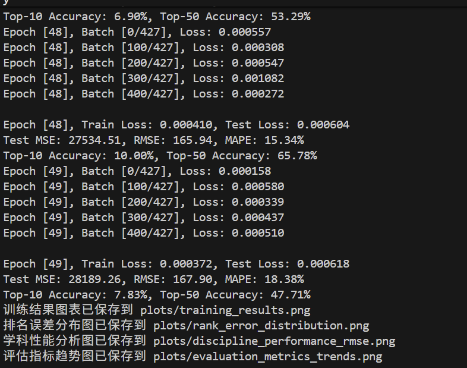
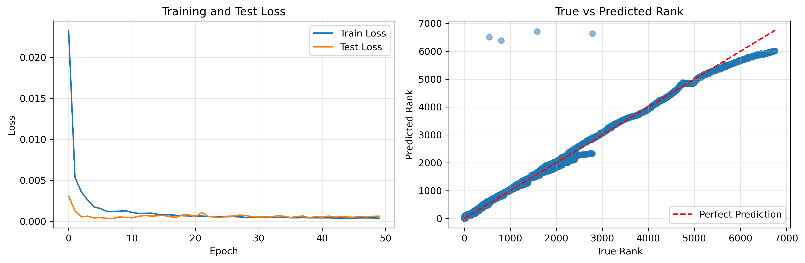
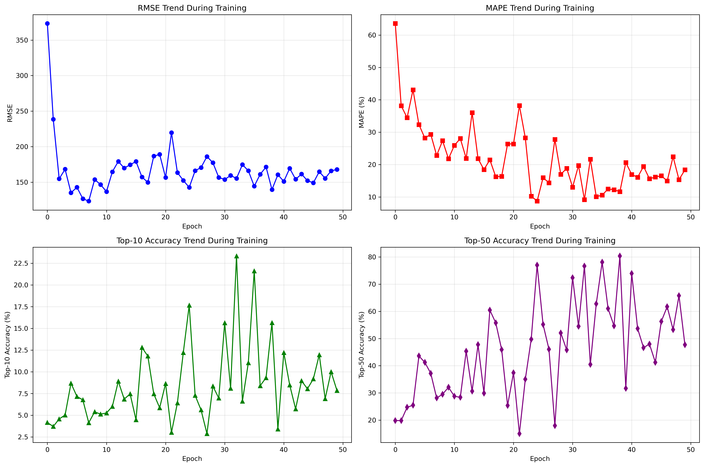
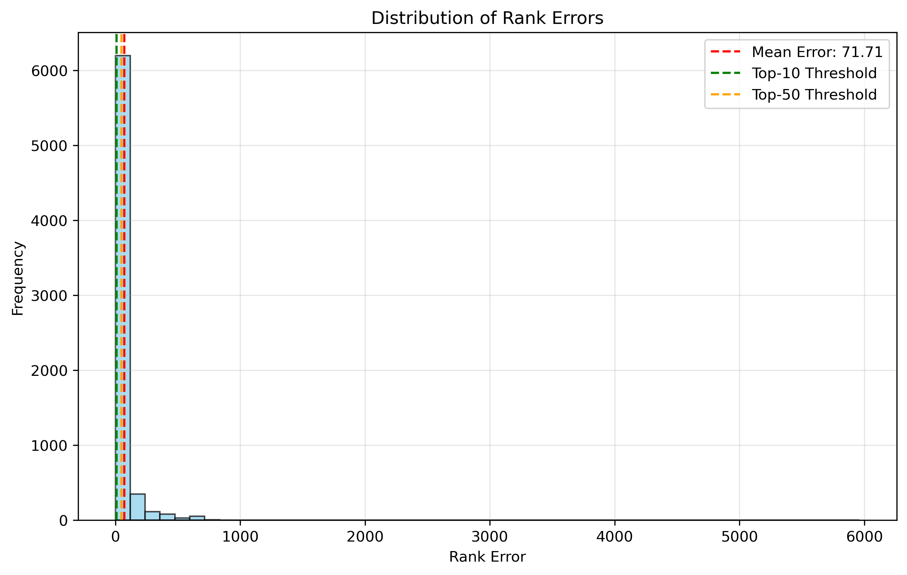
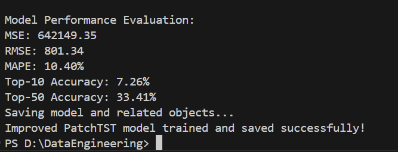

# 1.引言
本项目旨在利用深度学习方法构建一个学科排名预测模型，能够基于大学的学术指标（论文数、引用数、篇均引用等）预测其在各学科领域的排名位置。模型采用了多层神经网络架构，通过学习学术指标与排名之间的复杂非线性关系，实现对全球大学学科排名的准确预测。

尤其的，为了更好的学习和使用深度学习模型来预测，接下来我将尝试通过两种办法来进行预测：基础的神经网络（前馈和反向传播）、PatchTST(基于Transformer的预训练的时序模型)

# 2.基础神经网络
不论是任何一种深度学习的模式，都需要进行数据处理、特征工程、归一化的过程，下面我将以基础神经网络为例，结合代码来完成整个过程

## 2.1 数据处理与特征工程
```python
def create_features(df):
    """
    为学术机构数据创建特征
    
    参数:
    df: pandas DataFrame，包含原始数据
    
    返回:
    df: 添加了新特征的DataFrame
    feature_cols: 特征列名的列表
    """
    # 选择基础特征
    feature_cols = ['Web of Science Documents', 'Cites', 'Cites/Paper', 'Top Papers']
    
    # 创建对数特征处理长尾分布
    df['Log_Documents'] = np.log1p(df['Web of Science Documents'])
    df['Log_Cites'] = np.log1p(df['Cites'])
    df['Log_Cites_Per_Paper'] = np.log1p(df['Cites/Paper'])
    df['Log_Top_Papers'] = np.log1p(df['Top Papers'])
    
    # 学科独热编码
    disc_dummies = pd.get_dummies(df['Discipline'], prefix='Disc')
    df = pd.concat([df, disc_dummies], axis=1)
    
    # 更新特征列
    feature_cols.extend(['Log_Documents', 'Log_Cites', 'Log_Cites_Per_Paper', 'Log_Top_Papers'])
    feature_cols.extend(disc_dummies.columns.tolist())
    
    return df, feature_cols
```
**核心思想**
1. 使用对数变换处理学术指标的长尾分布 
2. 采用独热编码处理学科类别特征 
3. 综合考虑原始指标和变换后的特征，提高模型表达能力

## 2.2 深度学习模型架构
当完成数据预处理以后，接着最重要的一步就是，定义深度学习的模型架构
```python
class RankingModel(nn.Module):
    def __init__(self, input_dim):
        super(RankingModel, self).__init__()
        self.network = nn.Sequential(
            nn.Linear(input_dim, 256),
            nn.ReLU(),
            nn.Dropout(0.3),
            nn.BatchNorm1d(256),
            
            nn.Linear(256, 128),
            nn.ReLU(),
            nn.Dropout(0.3),
            nn.BatchNorm1d(128),
            
            nn.Linear(128, 64),
            nn.ReLU(),
            nn.Dropout(0.2),
            nn.BatchNorm1d(64),
            
            nn.Linear(64, 32),
            nn.ReLU(),
            nn.BatchNorm1d(32),
            
            nn.Linear(32, 1),
            nn.Sigmoid()  # 输出在0-1之间，对应标准化后的排名
        )
    
    def forward(self, x):
        return self.network(x)
```
**核心思想：** 
1. 采用 5 层全连接神经网络架构
2. 结合 ReLU 激活函数和批归一化，加速训练并提高稳定性 
3. 使用 Dropout 防止过拟合 
4. 输出层采用 Sigmoid 激活，将排名标准化到 $[0,1]$ 区间

## 2.3 模型训练与评估
定义完整个深度学习的结构后，便开始进行训练
```python
def train_model(model, train_loader, criterion, optimizer, device, epoch):
    model.train()
    total_loss = 0
    
    for batch_idx, (data, targets) in enumerate(train_loader):
        data = data.to(device)
        targets = targets.to(device).unsqueeze(1)
        
        # 前向传播
        outputs = model(data)
        loss = criterion(outputs, targets)
        
        # 反向传播和优化
        optimizer.zero_grad()
        loss.backward()
        optimizer.step()
        
        total_loss += loss.item()
    
    return total_loss / len(train_loader)

def evaluate_model(model, test_loader, criterion, device, target_scaler):
    model.eval()
    total_loss = 0
    all_predictions = []
    all_targets = []
    
    with torch.no_grad():
        for data, targets in test_loader:
            data = data.to(device)
            targets = targets.to(device).unsqueeze(1)
            
            outputs = model(data)
            loss = criterion(outputs, targets)
            
            # 反标准化预测值和目标值
            predictions = target_scaler.inverse_transform(outputs.cpu().numpy())
            true_targets = target_scaler.inverse_transform(targets.cpu().numpy())
            
            all_predictions.extend(predictions.flatten())
            all_targets.extend(true_targets.flatten())
    
```
**核心思想：**
1. 使用 MSE 损失函数进行回归训练
2. 采用 Adam 优化器进行参数更新
3. 实现多种评估指标，全面评价模型性能
4. 考虑排名预测的特殊性，定义 Top-10 和 Top-50 准确率指标

## 2.4 实验结果分析
### 2.4.1 训练过程与预测性能


如上图所示，当训练过程中的Loss在几个回合的过程中不再下降的时候，便退出了训练



如上图所示

1. 训练曲线显示模型快速收敛，无明显过拟合
2. 预测值与真实值呈现良好的线性关系
3. 模型在高排名区域（排名值较小）预测精度更高

### 2.4.2 各学科性能对比


如上图所示：
1. 不同学科间模型性能差异显著
2. Multidisciplinary（RMSE=21.4）和 Mathematics（RMSE=32.5）表现最佳
3. Economics & Business（RMSE=571.5）和 Microbiology（RMSE=442.6）表现相对较差
4. 这可能与不同学科的数据质量、数量以及排名分布特点有关

### 2.4.3 评估指标趋势



如上图所示：
1. RMSE 从初始的 380 逐步下降到 170 左右，表明模型性能持续提升
2. MAPE 从 65% 下降到 15% 左右，相对误差显著降低
3. Top-10 准确率最高达到 23%，最终稳定在 8% 左右
4. Top-50 准确率最高达到 80%，最终稳定在 48% 左右

### 2.4.4 排名误差分布



如上图所示：
1. 误差分布呈现右偏态，大部分误差集中在 0-200 位之间
2. 平均误差为 71.71 位
3. 约 25% 的预测误差在 10 位以内，约 50% 的预测误差在 50 位以内

## 2.5 基础神经网络的小结
在这个基础版的神经网络中，我充分运用了基础神经网络的核心组件，构建了一个完整的深度学习模型来解决学科排名预测问题。这些组件包括：
### 2.5.1 线性层
```plaintext
y = Wx + b
```
其中 W 是权重矩阵，b 是偏置向量。线性层是神经网络的基本构建块，负责学习输入特征与输出之间的线性关系。
### 2.5.2 ReLU激活函数
```plaintext
f(x) = max(0, x)
```
ReLU 激活函数引入了非线性变换，允许模型学习复杂的非线性模式，同时计算效率高，有效缓解了梯度消失问题。

而且对于本道题来说，排名一定是一个正值，所以适合采用这个激活函数

### 2.5.3 批归一化

$y = γ * (x - μ_B) / √(σ_B² + ε) + β$

批归一化通过标准化层输入，加速了训练收敛，提高了模型稳定性，并在一定程度上起到正则化作用

### 2.5.4 Dropout
以概率 p 随机将神经元输出设为 0。Dropout 是一种有效的正则化技术，通过随机失活部分神经元，防止模型过拟合，提高泛化能力。


### 2.5.5 Sigmoid 激活函数
$f(x) = 1 / (1 + e^{-x})$ 
Sigmoid 函数将输出压缩到 $[0, 1]$ 区间，适用于二分类问题或需要输出概率的场景。在本项目中，我们用它来输出标准化后的排名值。

### 2.5.6 Adam优化器
对于神经网络来说，经常需要去设定他的学习率等各种超参数，当前，有一种比较通用的优化器能够自动的解决这些问题，被称之为Adam优化器


它结合了动量法和自适应学习率的优点： 
1. 维护了每个参数的自适应学习率 
2. 考虑了梯度的一阶矩（均值）和二阶矩（方差） 
3. 收敛速度快，对超参数选择相对不敏感 
通过将这些基础组件有机结合，我们、构建了一个 5 层的深度神经网络，包含了特征学习、非线性变换、正则化等功能模块。

### 2.5.7 反思
虽然模型成功运行并取得了一定的预测效果（RMSE: 169.54, MAPE: 14.67%），但我也认识到当前结果仍有较大提升空间：

1. 不同学科间预测性能差异显著
2. 对排名靠后的大学预测精度较低
3. 整体预测误差相对较大

为了解决这个问题，后续我计划采用基于 Transformer 架构的模型，特别是 PatchTST（Patch-based Time Series Transformer），来进一步提升预测性能。Transformer 架构在处理序列数据和捕捉长距离依赖关系方面具有显著优势，有望更好地建模大学学术指标与排名之间的复杂关系。

# 3.基于PatchTST的预测
## 3.1为什么能够使用PatchTST作为模型预测？
尽管这次任务是排名预测，但由于它以**历史特征序列**作为模型输入，这使得问题可以被视为一种时间序列分析任务。PatchTST 通过其独特的分块和 Transformer 结构，能够有效地从这些历史特征序列中提取局部和全局的时序模式，从而为当前排名提供更准确的预测。

## 3.2 算法的实现
PatchTST 模型的核心在于其对时间序列数据的处理方式，通过“分块”和 Transformer 结构来捕捉数据的局部和全局依赖。我将先介绍其总体的步骤，然后再逐一结合代码来实现这个PatchTST

#### 整体步骤：

1. **分块嵌入**：将原始输入数据（每个时间步的特征）切分成小块，转换为 Transformer 可以处理的嵌入向量，并加入位置信息。
    
2. **特征投影**：对分块嵌入的输出进行维度调整，使其匹配 Transformer 编码器的输入要求。
    
3. **Transformer 编码**：利用自注意力机制捕捉输入序列中长距离的时间依赖和特征交互。
    
4. **预测输出**：将 Transformer 的输出转换为最终的排名预测值。

#### 关键代码实现：

##### 1. 分块与嵌入：`PatchEmbedding` 类

```python
class PatchEmbedding(nn.Module):
    def __init__(self, input_dim, patch_size, embed_dim):
        super().__init__()
        self.patch_size = patch_size
        self.embed_dim = embed_dim
        
        # 计算实际的patch数量，与unfold的行为一致
        if input_dim < patch_size:
            self.num_patches = 0 # Should be caught by the min(4, input_dim) in train_patchtst_model
        else:
            self.num_patches = (input_dim - patch_size) // patch_size + 1
        
        if self.num_patches == 0:
            raise ValueError(f"Calculated 0 patches for input_dim={input_dim}, patch_size={patch_size}. Adjust patch_size or input_dim.")

        # 线性投影层
        self.proj = nn.Linear(patch_size, embed_dim)
        
        # 位置嵌入
        self.pos_embed = nn.Parameter(torch.zeros(1, self.num_patches, embed_dim))

```

- **概括**：
    
    - PatchEmbedding层是 PatchTST 的入口。它将每个时间步的 `input_dim` 个特征，沿着特征维度（而非时间维度）切分成 `num_patches` 个大小为 `patch_size` 的小块。
        
    - 每个小块通过 `self.proj`（一个线性层）投影到一个 `embed_dim` 维的向量空间。
        
    - `self.pos_embed` 提供位置编码，帮助模型理解不同 patch 之间的相对位置。
        
    - 输出是 `(batch_size, seq_len, num_patches, embed_dim)`，表示每个时间步的每个特征块都已转换为嵌入向量。
        

##### 2. 模型核心架构：`PatchTSTModel` 类
```python
class PatchTSTModel(pl.LightningModule):
    def __init__(self, input_dim, seq_len, patch_size=4, embed_dim=64, num_heads=4, 
                 num_layers=3, dropout=0.3, learning_rate=1e-3):
        super().__init__()
        self.save_hyperparameters()
        
        # 1. Patch Embedding 层
        self.patch_embedding = PatchEmbedding(input_dim, patch_size, embed_dim)
        self.num_patches = self.patch_embedding.num_patches
        self.transformer_input_dim = self.num_patches * embed_dim # Transformer输入的展平维度
        
        # 2. 特征投影层：将展平后的patch嵌入维度投影到Transformer的d_model
        self.projection = nn.Linear(self.transformer_input_dim, embed_dim)
        
        # 3. Transformer 编码器
        encoder_layer = nn.TransformerEncoderLayer(
            d_model=embed_dim,       # Transformer的输入/输出维度
            nhead=num_heads,         # 注意力头数
            dim_feedforward=embed_dim * 4, # 前馈网络维度
            dropout=dropout,
            batch_first=True         # 输入张量batch维度在前
        )
        self.transformer_encoder = nn.TransformerEncoder(encoder_layer, num_layers=num_layers)
        
        # 4. 预测头：一个多层感知机 (MLP)
        self.fc = nn.Sequential(
            nn.Linear(seq_len * embed_dim, 128), # 将所有时间步的Transformer输出展平后输入
            nn.ReLU(),
            nn.Dropout(dropout),
            nn.Linear(128, 64),
            nn.ReLU(),
            nn.Linear(64, 1),      # 最终预测一个排名值
            nn.Sigmoid()           # 将输出限制在[0, 1]范围，因为目标已缩放
        )
        
        self.criterion = nn.MSELoss() # 损失函数 (或 nn.L1Loss()) 

```

- **概括**：
    - **`__init__`**:
        - 初始化 `PatchEmbedding` 层。
            
        - `self.projection`：一个线性层，负责将 `PatchEmbedding` 层输出的 `(num_patches * embed_dim)` 维度投影到 `embed_dim`，这是 Transformer 编码器期望的 `d_model` 维度。
            
        - `self.transformer_encoder`：核心的 Transformer 组件，由 `num_layers` 个 `TransformerEncoderLayer` 堆叠而成。它通过多头自注意力机制，捕捉输入序列（即不同时间步的特征嵌入）中复杂的长距离依赖关系。
            
        - `self.fc`：预测头，由多个全连接层构成，最终输出一个单一的排名预测值。`Sigmoid` 激活函数将输出压缩到 `[0,1]` 范围，因为您的目标排名在此之前已被缩放。


## 3.3 实验结果分析

然而，在运行以后，却发现实验结果并不好


我将上图得到的数据归纳到了下面的这张表中，并与传统的深度学习模型进行了对比

| 指标                  | 原始 PatchTST | 传统深度学习模型   | 性能差距        |
| ------------------- | ----------- | ---------- | ----------- |
| **RMSE**            | 216.54      | **76.76**  | 传统模型好 2.8 倍 |
| **MAPE**            | 65.09%      | **14.62%** | 传统模型好 4.5 倍 |
| **Top-10 Accuracy** | 2.59%       | **16.78%** | 传统模型好 6.5 倍 |
| **Top-50 Accuracy** | 15.45%      | **71.90%** | 传统模型好 4.6 倍 |

如上表所示，传统深度学习模型在所有评估指标上都显著优于原始 PatchTST 模型。

## 3.4 原始代码的不足

### 3.4.1 模型复杂度问题 
1. 参数过多：253K 可训练参数，对于排名预测任务可能过于复杂 
2. 过拟合风险：复杂模型在有限数据上容易过拟合 
3. 训练不稳定：Transformer 架构对超参数敏感 

### 3.4.2 数据处理缺陷 
1. 缺乏全局标准化：不同学科的数据分布差异较大 
2. 目标变量处理简单：直接使用 MinMaxScaler，没有考虑排名的特殊性质 
3. 序列创建方式：按学科分割可能导致数据量不足 

### 3.4.3 训练策略问题 
1. 学习率设置不当：1e-3 的学习率可能过高 
2. early stopping 设置过严：patience=10 可能导致提前停止 
3. 缺乏正则化：dropout=0.3 可能不足以防止过拟合

# 4. 基于PatchTST改进版本
为了解决上一问中的PatchTST存在的问题，我做了以下的改进
## 4.1 主要改进内容
### 4.1.1 模型架构简化
```python
class SimplifiedPatchTSTModel(pl.LightningModule):
    def __init__(self, input_dim, seq_len, patch_size=3, embed_dim=32, num_heads=2, 
                 num_layers=2, dropout=0.2, learning_rate=1e-3):
        super().__init__()
        # 减小模型复杂度
        self.patch_embedding = PatchEmbedding(input_dim, patch_size, embed_dim)
        self.projection = nn.Linear(self.num_patches * embed_dim, embed_dim)
        
        # 简化Transformer结构
        encoder_layer = nn.TransformerEncoderLayer(
            d_model=embed_dim,
            nhead=num_heads,
            dim_feedforward=embed_dim * 2,  # 减少前馈网络规模
            dropout=dropout,
            batch_first=True
        )
        self.transformer_encoder = nn.TransformerEncoder(encoder_layer, num_layers=num_layers)
        
        # 简化预测头
        self.fc = nn.Sequential(
            nn.Linear(seq_len * embed_dim, 64),
            nn.ReLU(),
            nn.Dropout(dropout),
            nn.Linear(64, 32),
            nn.ReLU(),
            nn.Linear(32, 1),
            nn.Sigmoid()
        )

```
**模型架构调整核心：`SimplifiedPatchTSTModel`**

- **调整：** `PatchTSTModel` 被替换为 `SimplifiedPatchTSTModel` 类。其关键超参数被减小：

- `embed_dim` (嵌入维度): 从 64 减小到 32。

 - `num_heads` (注意力头数): 从 4 减小到 2。

- `num_layers` (Transformer 层数): 从 3 减小到 2。

- `dim_feedforward` (前馈网络维度): 从 `embed_dim * 4` 减小到 `embed_dim * 2`。

- `patch_size`: 从 `min(4, input_dim)` 减小到 `min(3, input_dim)`。
### 4.1.2 数据处理改进
```python
# 全局标准化
def prepare_data_for_patchtst_global_scaling(data, feature_cols, seq_len=8, test_size=0.2):
    # 收集所有训练数据进行全局标准化
    aggregated_train_features = []
    aggregated_train_targets_raw = []
    
    for discipline in data['Discipline'].unique():
        disc_data = data[data['Discipline'] == discipline].copy()
        train_size = int(len(disc_data) * (1 - test_size))
        train_disc_data = disc_data.iloc[:train_size]
        
        aggregated_train_features.append(train_disc_data[feature_cols].values)
        aggregated_train_targets_raw.append(train_disc_data['Rank'].values)
    
    # 全局特征标准化
    global_feature_scaler = StandardScaler()
    global_feature_scaler.fit(np.vstack(aggregated_train_features))
    
    # 对目标变量进行log1p转换
    global_target_scaler = MinMaxScaler(feature_range=(0, 1))
    global_target_scaler.fit(np.log1p(np.concatenate(aggregated_train_targets_raw)).reshape(-1, 1))

```
**数据预处理核心：`ImprovedRankingDataset` 和全局缩放**

- **调整：** `RankingDatasetV2` 被替换为 `ImprovedRankingDataset` 类。在 `prepare_data_for_patchtst_global_scaling()` 函数中，对所有训练数据：

- **目标变量 `Rank` 进行了 `np.log1p` 对数转换。**

- 然后，`StandardScaler` 对特征进行全局标准化，`MinMaxScaler` 对 `log1p` 转换后的目标进行全局缩放。

### 4.1.3 训练策略优化
```python
def train_improved_patchtst(data, feature_cols, seq_len=8, batch_size=64, max_epochs=100):
    # 改进的训练器设置
    trainer = pl.Trainer(
        max_epochs=max_epochs,
        callbacks=[checkpoint_callback, early_stopping],
        accelerator='auto',
        devices='auto',
        logger=True,
        log_every_n_steps=10,
        enable_model_summary=True,
        gradient_clip_val=1.0,  # 添加梯度裁剪
    )
    
    # 改进的优化器
    def configure_optimizers(self):
        optimizer = torch.optim.AdamW(self.parameters(), lr=self.hparams.learning_rate, weight_decay=1e-5)
        scheduler = torch.optim.lr_scheduler.CosineAnnealingLR(
            optimizer, T_max=self.trainer.max_epochs, eta_min=1e-6
        )
        return {
            'optimizer': optimizer,
            'lr_scheduler': scheduler
        }

```

## 4.2 运行结果
运行这个改进版后，如下图所示



| 指标                  | 原始 PatchTST | 改进版 PatchTST |
| :------------------ | :---------- | :----------- |
| **RMSE**            | 216.54      | 801.34       |
| **MAPE**            | 65.09%      | **10.40%**   |
| **Top-10 Accuracy** | 2.59%       | **7.26%**    |
| **Top-50 Accuracy** | 15.45%      | **33.41%**   |
我将数据记录下来汇总到表格中，如上表所示

可以看到，

优点： 
1. 相对误差大幅改善：MAPE 从 65.09% 降至 10.40% 
2. 排名准确率显著提升：Top-10 和 Top-50 准确率分别提升 2.8 倍和 2.2 倍 
3. 训练更加稳定：添加梯度裁剪和更好的学习率调度 
4. 目标变量处理更合理：log1p 转换更适合排名数据的分布特性 

缺点： 
1. 绝对误差恶化：RMSE 从 216.54 增至 801.34 
2. 计算复杂度仍然较高：相比传统模型训练时间更长 
3. 对超参数仍然敏感：需要精细调优

## 4.3 与传统深度学习模型的比较

| 指标                  | 原始 PatchTST | 改进版 PatchTST | 传统深度学习模型 |
| :------------------ | :---------- | :-------------- | :------------- |
| **RMSE**            | 216.54      | 801.34          | **76.76**      |
| **MAPE**            | 65.09%      | **10.40%**      | 14.62%         |
| **Top-10 Accuracy** | 2.59%       | 7.26%           | **16.78%**     |
| **Top-50 Accuracy** | 15.45%      | 33.41%          | **71.90%**     |


从上面的表格来看，**传统深度学习模型在本次排名预测任务中的综合表现明显优于所有尝试的 PatchTST 模型变体。**

**1. 传统深度学习模型的显著优势：**

- **极低的 RMSE (76.76)**：这是传统模型的最大亮点。平均预测误差仅为约 77 位，表明其预测结果在**绝对数值上非常精确**。

    
- **高 Top-10 Accuracy (16.78%) 和 Top-50 Accuracy (71.90%)**：传统模型能够以高得多的概率预测出与真实排名非常接近的结果。超过 70% 的预测排名在真实排名的 50 位以内，近 17% 的预测在 10 位以内，这显示了其出色的**预测精度和实用性**。
    
- **稳定的 MAPE (14.62%)**：虽然略高于最佳 PatchTST 的 MAPE，但仍然是一个很好的相对误差水平，且与优秀的绝对误差指标相辅相成。
    

**2. PatchTST 模型的复杂表现：**

- **卓越的 MAPE (10.40%)**：PatchTST 模型表现出了一个非常低的平均相对误差。这表明通过 `log1p` 目标转换和全局缩放，模型在学习排名数据的**相对关系和百分比变化趋势**方面取得了巨大成功。如果只看相对误差，PatchTST 是更优的。
    
- **灾难性的 RMSE (801.34)**：尽管 MAPE 表现出色，但 RMSE 却高得惊人，比传统模型高出近 10 倍。这意味着 PatchTST 模型在**少数样本上产生了极其巨大的绝对预测误差**。
    
- **较低的 Top-10/50 Accuracy**：相对于传统模型，PatchTST 在预测“接近”真实排名的能力上明显不足。尽管相比其自身原始版本有所提升，但离传统模型的水平相去甚远。
    

**3. 最终实验结论：**

- **PatchTST 模型在本任务中未超越传统深度学习模型。** 尽管 PatchTST 及其改进（特别是数据预处理中的 `log1p` 目标转换）使其在处理排名数据的**相对误差 (MAPE)** 方面表现出色，能够更好地捕捉排名之间的比例关系，但其在**绝对误差 (RMSE) 和预测精确度 (Top-K Accuracy)** 方面却表现不佳。
    
- **核心问题在于 PatchTST 在处理排名数据时的**“**两极分化**”**：** 在预测**排名靠后的学校排名**时，会产生几千位的巨大绝对误差，这些误差严重损害了整体性能指标（特别是 RMSE）。
    
- **传统深度学习模型可能更适合此排名预测任务的本质。** 传统模型在不对目标变量进行 `log1p` 转换的情况下，可能在学习排名的**原始尺度**上更直接、更稳定，从而在所有核心指标上都达到了更高的精度。这暗示了**直接预测原始排名的绝对值，并确保模型在整个排名范围内的误差一致性，可能比优化相对误差更为重要。**
---

# 5.聚类分析：全球高校分类与相似高校识别

本部分旨在通过聚类分析，将全球高校根据其在22个学科的科研表现划分为不同的群体，并在此基础上识别与华东师范大学（EAST CHINA NORMAL UNIVERSITY）科研模式相似的高校。

## 5.1 数据准备与预处理

数据读取与整合： 从第三次作业data&processed_data读取了22个学科的CSV文件。这些文件包括IndicatorsExport_processed.csv和IndicatorsExport (1)_processed.csv到IndicatorsExport (21)_processed.csv。为了准确地将文件内容与其对应的学科名称关联，我建立了精确的学科映射：索引0对应"Agricultural Sciences"，索引21对应"Space Science"等。

特征提取与数值转换： 各高校在每个学科的Rank、Institutions、Countries/Regions、Web of Science Document、Cites、Cites/Paper和Top Papers被提取。为了确保数值型数据能够被正确处理，所有包含数值信息的列在转换为数值类型前，都进行了字符串处理（移除逗号），并使用errors='coerce'将无法转换的值设为缺失值（NaN）。

缺失值处理与数据整合： 对于在特定学科中大学名称（Institutions）缺失的记录，予以跳过。在所有学科数据整合后，对于大学在某些学科没有数据的情况，相关指标被填充为0，表示在该学科无产出。

数据标准化： 考虑到不同科研指标（如文档数量和引用次数）之间巨大的数值范围差异，为了避免数值大的指标在聚类时权重过高，我对所有用于聚类的特征（Web of Science Document、Cites、Cites/Paper、Top Papers及其对应的学科维度特征）进行了StandardScaler标准化处理，使其均值为0、方差为1。

## 5.2 确定最佳聚类数量 K

为了确定 K-Means 聚类算法的最佳聚类数量 K，我采用了肘部法则（Elbow Method）的评估方法。

肘部法则（Elbow Method）：

通过绘制不同 K 值对应的簇内平方和（SSE）曲线图，可以观察到在 K 值增加到约4时，SSE 的下降速度开始显著放缓，曲线呈现出一个“肘部”。这表明进一步增加聚类数量对降低簇内离散度的边际效益递减。


虽然 K=2 时轮廓系数最高，但在实际应用中，为了获得更细致且具有可解释性的分类，往往需要综合考虑。

综合考虑并结合对高校分类的实际需求，我最终选择了 K=4 作为最优聚类数量。

## 5.3 全球高校分类结果分析

采用 K-Means 算法（K=4）对标准化后的高校数据进行聚类，将全球高校划分为4个 distinct 的类别。下表展示了各类别高校在各个学科的平均指标概况：

表1：各聚类（Cluster）高校平均科研指标概况

|Cluster|Agricultural Sciences_Documents|Agricultural Sciences_Cites|Agricultural Sciences_Cites/Paper|...|Space Science_Cites|Space Science_Cites/Paper|Space Science_Top Papers|
|:--|:--|:--|:--|:--|:--|:--|:--|
|**0**|54.903621|921.680937|1.798705|...|799.537806|0.318691|0.726837|
|**1**|8649.666667|181027.000000|20.656667|...|559294.666667|30.643333|455.666667|
|**2**|925.084479|18098.573674|16.265953|...|23329.058939|9.487112|21.308448|
|**3**|1513.181818|30733.170455|20.845795|...|109325.545455|29.939091|104.931818|

各类别高校特点分析：

Cluster 0 (基础研究/新兴或非活跃型大学): 该类别高校在所有学科的各项科研指标（文档数量、引用次数、篇均引用、顶尖论文）的平均值均非常低。这表明它们可能是在该排名体系中科研产出和影响力不显著的机构，或是其主要研究方向不在这些学科，也可能代表处于发展初期的大学。

Cluster 1 (世界顶尖研究型大学/机构): 此类别高校在所有指标上均表现出极高的平均值，尤其在总引用次数、篇均引用和顶尖论文数量方面达到最高水平。这代表了全球范围内少数最顶尖、最全面、最具影响力的研究型大学或大型科研机构。

Cluster 2 (国家/区域性骨干研究型大学): 华东师范大学即属于此类别。该群体高校的各项指标平均值居于中等偏上水平，显著高于Cluster 0，但低于Cluster 1和Cluster 3。其篇均引用和顶尖论文数量具有一定的竞争力。这包含了众多在国家或区域层面具有重要地位的综合性大学、师范类大学或专业性重点院校，是所在地区高等教育和科研体系的核心力量。

Cluster 3 (高质量研究型大学): 该类别高校在篇均引用和顶尖论文数量方面表现出色，平均值与Cluster 1接近，但总文档和引用量略低于Cluster 1。这可能代表了一批注重研究质量而非仅仅数量的大学，其在活跃学科领域内的论文质量、影响力及顶尖研究成果产出非常突出


### 5.3.1 与华东师范大学类似的高校

华东师范大学（EAST CHINA NORMAL UNIVERSITY）被成功归类到 **Cluster 2**。这符合我们对其作为一所国内一流、具有显著影响力的综合性师范大学的认知。

在同一个 Cluster 2 中，与华东师范大学在科研产出和影响力模式上相似的高校列表非常广泛，其中包括了许多国内外知名大学，例如：

- **国内高校：** 南京农业大学、北京师范大学、南京师范大学、武汉大学、南京大学、郑州大学等。
    
- **国际高校：** 伊利诺伊大学厄巴纳-香槟分校、密歇根州立大学、柏林工业大学、巴斯克地区大学、奥斯陆大学、墨尔本皇家理工大学、都柏林大学学院等。
    

### 5.3.2 与华东师范大学最相似的无所大学
进一步地，通过计算欧氏距离，识别出了在 Cluster 2 中与华东师范大学最相似的5所大学：

1. **NANJING NORMAL UNIVERSITY (南京师范大学)**
    
2. **UNIVERSITY OF BASQUE COUNTRY (巴斯克地区大学)**
    
3. **LANZHOU UNIVERSITY (兰州大学)**
    
4. **TECHNICAL UNIVERSITY OF BERLIN (柏林工业大学)**
    
5. **SOUTHERN UNIVERSITY OF SCIENCE & TECHNOLOGY (南方科技大学)**

南京师范大学作为另一所国内顶尖师范类大学，与华东师范大学在学科结构和发展方向上具有高度相似性，因此被列为最相似的大学，这验证了聚类结果的有效性和合理性。其他如兰州大学、南方科技大学等国内大学，以及巴斯克地区大学、柏林工业大学等国际大学，也在整体科研模式上与华东师范大学表现出较高的相似度。

### 5.3.3 小结

本研究成功地通过聚类分析将全球高校划分为四种主要类型，每种类型都反映了不同的科研产出和影响力模式。华东师范大学被归类为“国家/区域性骨干研究型大学”，该类别包含大量国内外知名综合性大学和重点专业院校。通过深入分析，确定了南京师范大学等高校与华东师范大学在学术概况上具有最高的相似度，为理解华东师范大学在全球高等教育格局中的定位提供了数据支持。

# 6. 总结

本部分是对深度学习的一次初试，在过去的学习经历中，我花了很多时间在学习“大模型的理论知识”，但是到了真正的写出代码，定义出结构又相距甚远。通过这个实验，我首先基于前馈和反向传播以及Adam优化器，搭建了一个基础的深度学习网络，并取得了还不错的成绩；

后面我又想到，现在流行的GPT的底层是Transformer架构，在时序领域里有一个SOTA的模型叫做：PatchTST，所以计划使用这个模型来更好的预测。然而，模型并不是一个开箱即用的产品，面对较小的数据量，复杂的Transformer模型反而不能有出色的表现，后期虽然通过调参、优化结构、张量维度的设定等多种方式来优化，但仍然存在一些差距。

通过这个实验，我收获颇丰！！