# 1. Mysql安装和简介
Mysql是一种关系型，开源的数据库，比较适合用来存储表格形式的数据

其中，下载安装过后，可以分为2个部分


1. Server
数据库核心工作的地方，它是一个后台运行的服务，负责存储和管理数据，它本身没有图形化界面。

2. MySQL Workbench 8.0 CE
这个是一个图形化的工具，用于管理MySQL数据库；通过这个图形化界面，连接到 MySQL 服务器，执行 SQL 查询，管理数据库、表、用户等


### Schema 和数据库的关系

在很多关系型数据库（如 Oracle、PostgreSQL）中，`Schema` 和 `Database` 是两个有明确区别的概念。

- **Database (数据库):** 是物理上独立的一个或多个文件集合，包含了所有数据、索引、日志等，是一个大的容器。


- **Schema (模式):** 是一组逻辑对象的集合，如表、视图、存储过程、函数等，它们属于同一个用户或应用程序，通常在一个数据库之内。一个数据库可以有多个 schema。

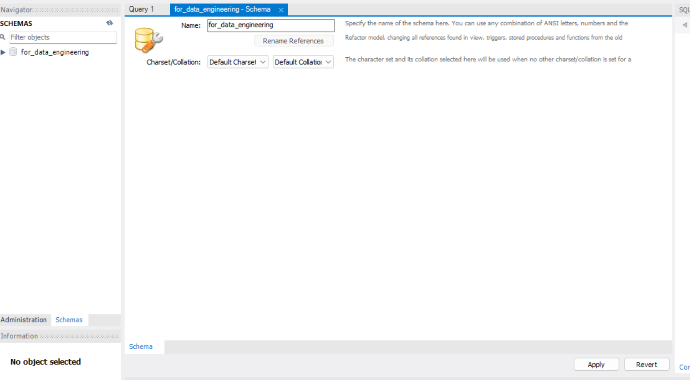

然而，在 **MySQL** 中，`Schema` 和 `Database` 在很多情况下是可以互换使用的

**简而言之：**

- **在 MySQL 中，`CREATE SCHEMA` 和 `CREATE DATABASE` 语句是等效的。** 它们都会创建一个新的数据库（在物理上）。
    
- 在 Workbench 的“Schemas”面板中看到列表时，它显示的就是您所有的数据库。
    
- 通常我们更习惯称之为“数据库”，但 MySQL Workbench 使用“Schemas”这个术语来指代它们。

# 2.创建数据库和表结构（Schema设计）
在正式导入数据之前，通常需要先设计一个合理的表结构来存储这些信息

目前有22个.csv文件，每一个文件都代表一个学科（例如 `AGRICULTURAL SCIENCES.csv`, `BIOLOGY & BIOCHEMISTRY.csv` 等）

进入每一个文件会发现，第一行和最后一行都不是数据。第二行是列标题。数据从第三行开始。

**Schema 设计思路：**

由于每个 CSV 文件代表一个学科，而所有学科的数据结构都是相同的，可以设计一个主表来存储所有的机构数据，并且添加一个字段来标识该数据属于哪个学科。

**字段设计：**

id: 主键，自增长，唯一标识每一条记录。

discipline: 存储学科名称

ranking: 存储该机构在该学科中的排名。

institution_name: 机构名称。

country_region: 国家/地区。

web_of_science_documents: Web of Science 文档数量。

cites: 引文数量。

cites_per_paper: 平均每篇引文数量。

top_papers: 顶级论文数量。

### 具体的操作步骤如下
1. 创立一个新的数据库，对于这个项目来说，我创建了一个名为 `sci_data_analysis` 的数据库
```sql
-- 创建一个新的数据库
CREATE DATABASE IF NOT EXISTS sci_data_analysis;

-- 切换到这个新创建的数据库
USE sci_data_analysis;
```
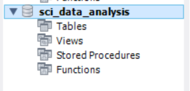

2. 创建 `institution_performance` 表
```sql
CREATE TABLE institution_performance (
    id INT PRIMARY KEY AUTO_INCREMENT,
    discipline VARCHAR(255) NOT NULL,
    ranking INT NOT NULL, -- 新增的排名字段
    institution_name VARCHAR(255) NOT NULL,
    country_region VARCHAR(100) NOT NULL,
    web_of_science_documents INT,
    cites INT,
    cites_per_paper DECIMAL(10, 2),
    top_papers INT
);
```

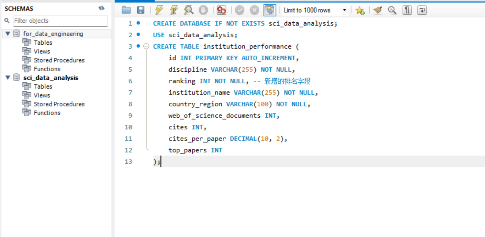

---
# 3.数据的导入
由于现在有多个csv文件，每一个文件需要做一些特殊的处理，包括：删除前两行和最后一行，需要添加第一列的列名（也就是ranking）等等操作

## 3.1 相关环境的配置
为了更快更便捷的将这22个文件传入到数据库中，我通过Python的脚本的方式来实现
1. 安装相关的python的库
```bash
pip install pandas mysql-connector-python
```
2. 将所有csv放在一个文件夹中，将python文件放在和这个文件夹同级别的文件夹中


## 3.2 导入脚本的编写

脚本的编写，由于篇幅限制，下面仅列出比较重要的几个地方，比如与数据库的连接
```bash
DB_CONFIG = {
    'host': '127.0.0.1',
    'user': 'root',
    'password': 'Lzy225678', 
    'database': 'sci_data_analysis' 
}
```

导入csv的函数，用于处理包含编码格式，丢弃不需要的行等操作
```bash
def import_csv_to_mysql(file_path, discipline_name, connection):
    print(f"正在导入文件: {file_path} (学科: {discipline_name})...")
    try:
        df = pd.read_csv(
        file_path,
        skipinitialspace=True,
        skiprows=[0, 1],
        header=None,
        encoding='latin-1' 
    )
        # 检查DataFrame是否为空，避免在空DataFrame上调用.drop()
        if not df.empty:
            df = df.drop(df.tail(1).index) # 删除最后一行
```

定义导入列的结构，并对缺失值进行处理，此处通过$``$的方式来填补缺失值
```bash
        df_to_insert = df[[
            'ranking',
            'institution_name',
            'country_region',
            'web_of_science_documents',
            'cites',
            'cites_per_paper',
            'top_papers'
        ]].copy() # 使用.copy()避免SettingWithCopyWarning
        df_to_insert['discipline'] = discipline_name

        # 填充所有 NaN 为空字符串，特别是针对 VARCHAR(NOT NULL) 字段
        df_to_insert = df_to_insert.fillna('')
```
每一次数据库运行完以后，都需要执行关闭数据库的操作，来确保数据安全

```bash
if 'conn' in locals() and conn.is_connected():
            conn.close()
            print("数据库连接已关闭。")
```

以上，便是整个导入过程的核心部分

## 3.3 导入过程中遇到的困难和解决方案
在实际导入的过程中，其实遇到了很多困难

1. 比如对于Mysql的界面来说，需要先选中，后点击运行按钮，才可以真正的创建schema，否则会如下图所示未找到对应的schema

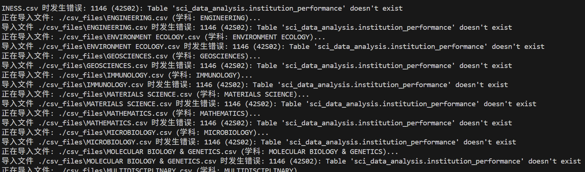
2. 比如对于csv中有些列存在缺失值，对于MySQL来说，不接受NaN值，需要将其替换，才可以正确导入
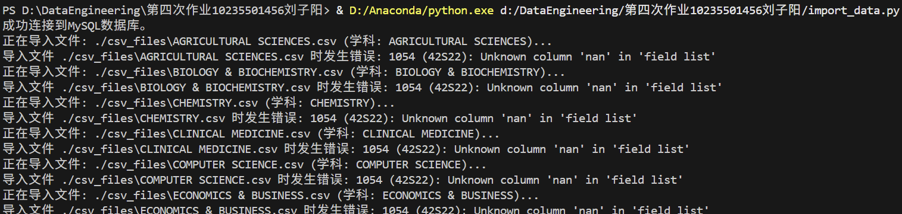

通过打印出前五行的数据，定位出该问题

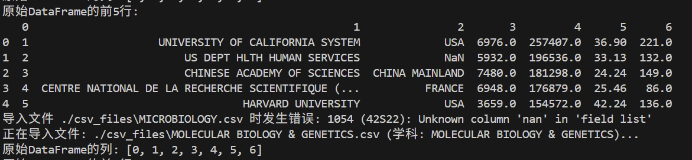
3. 比如在去除前两行的基础上，每一个数据集的最后，有一个copywright的声明，在这样的情况下，也需要有一个删除的处理
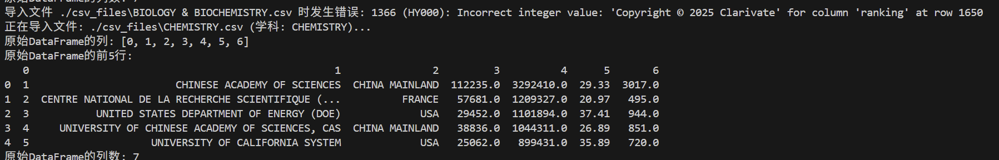

至此，数据库成功导入

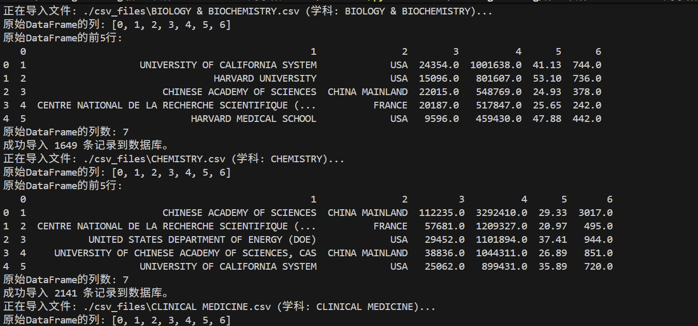
进入WorkBench界面，可以看到正常保存

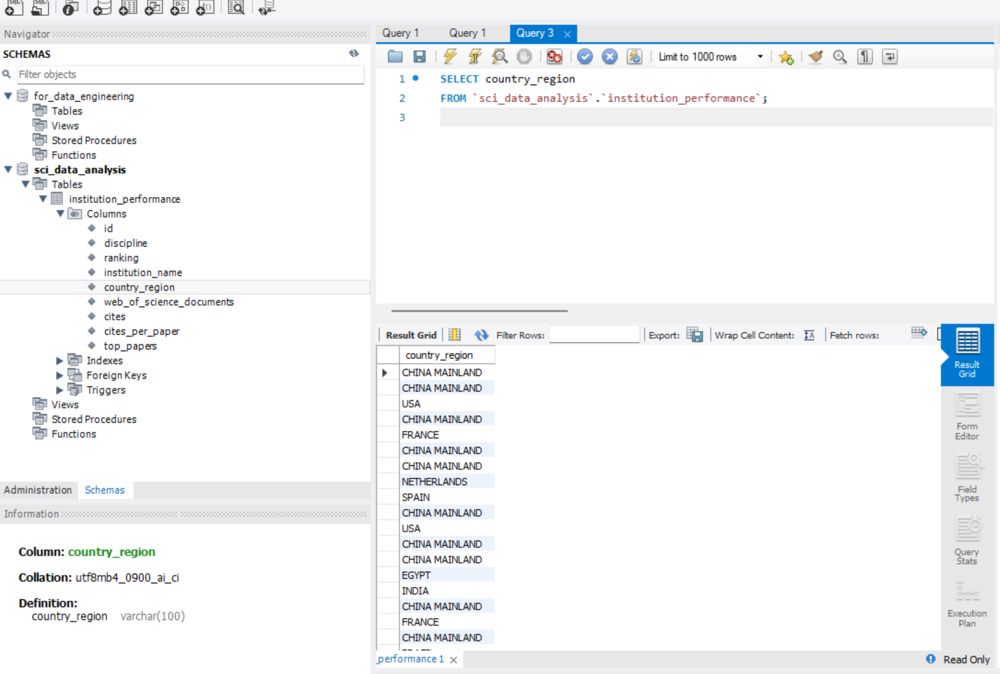

# 4.获取华东师范大学在各个学科中的排名

对于SQL来说，核心其实就是五个关键字
From用来定义从哪些表中取数据
Select用来定义取哪些列的数据
Where用来定义从表格维度的筛选
Order By作为一个函数来对筛选出来的结果进行排序
Group By用来从列的维度，对数据进行聚合，从而进一步的筛选

对于本道题来说，
其实只需要关注提取出“EAST CHINA NORMAL UNIVERSITY”即可
```sql
USE sci_data_analysis;

SELECT
    discipline,
    institution_name,
    ranking,
    web_of_science_documents AS Documents,
    cites AS Cites,
    cites_per_paper AS Cites_Per_Paper,
    top_papers AS Top_Papers
FROM
    institution_performance
WHERE
    institution_name = 'EAST CHINA NORMAL UNIVERSITY' 
ORDER BY
    discipline, ranking;

```
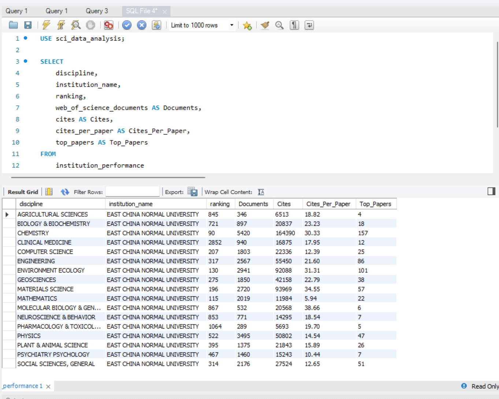
如上图所示，查询结果如上图所示

# 5.获取中国（大陆地区）大学在各个学科中的表现

这道题和上一道有一点类似，上一道题是去匹配instituion_name
而这一道题，是去匹country_region
也就是用

WHERE country_region = 'CHINA MAINLAND'

```bash
USE sci_data_analysis;

SELECT
    discipline,
    ranking,
    institution_name,
    web_of_science_documents AS Documents,
    cites AS Cites,
    cites_per_paper AS Cites_Per_Paper,
    top_papers AS Top_Papers
FROM
    institution_performance
WHERE
    country_region = 'CHINA MAINLAND'
ORDER BY
    discipline, ranking;

```
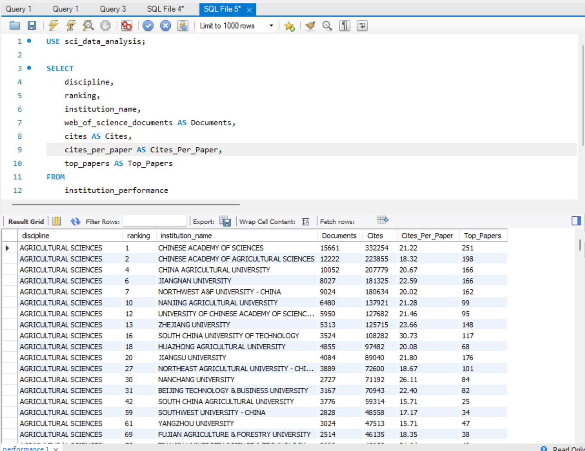
如下图所示，可以看到返回的结果为

每一个学科中国高校的排名 

为了更进一步的去分析，中国大陆作为一个整体，总文档数、平均引用数，我使用Group By来进行进一步的查询

```sql
SELECT
    discipline,
    COUNT(DISTINCT institution_name) AS num_institutions,
    SUM(web_of_science_documents) AS total_documents,
    SUM(cites) AS total_cites,
    AVG(cites_per_paper) AS avg_cites_per_paper,
    SUM(top_papers) AS total_top_papers
FROM
    institution_performance
WHERE
    country_region = 'CHINA MAINLAND'
GROUP BY
    discipline
ORDER BY
    discipline;

```

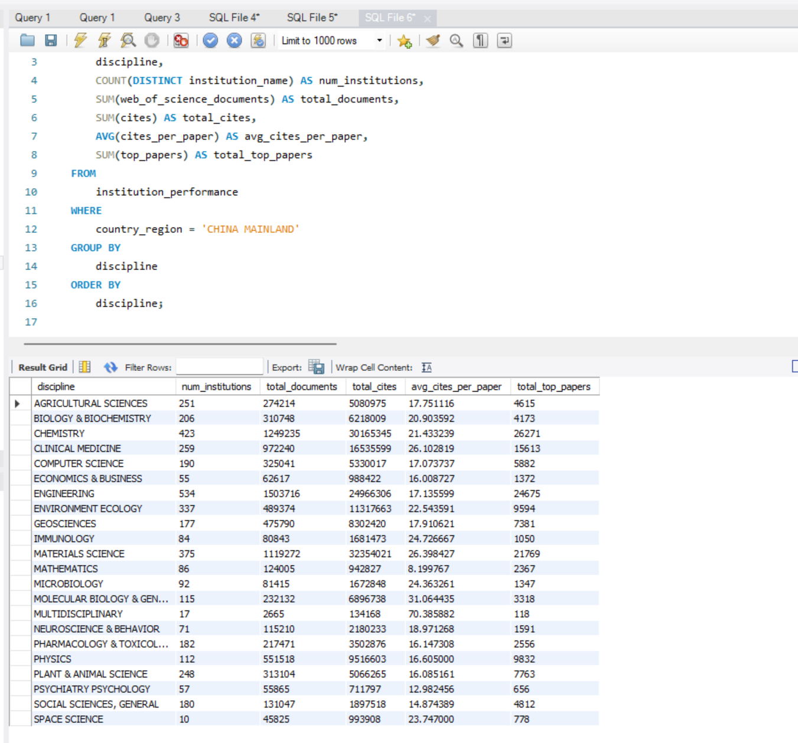
通过上面的查询，可以看到中国高校在每一个学科上的总体上的表现


# 6.分析全球不同区域在各个学科上的表现
上一问，我已经讨论了中国高校在各个学科上的表现，而对于这一问，其实只需要把所有的country_region引入进来即可


此外，相比于去计算总体的papers或者引用数，都有一些绝对，因为有的地方发的文章很多，但几乎没有人愿意引用他们，在这样的情况下，**我考虑用 Cites/Paper的方式，计算出该地区的 篇均引用数**
```sql
USE sci_data_analysis;

SELECT
    discipline,
    country_region,
    COUNT(DISTINCT institution_name) AS num_institutions,
    SUM(web_of_science_documents) AS total_documents,
    SUM(cites) AS total_cites,
    
    SUM(cites) / NULLIF(SUM(web_of_science_documents), 0) AS calculated_cites_per_paper,
    SUM(top_papers) AS total_top_papers
FROM
    institution_performance
GROUP BY
    discipline, country_region
ORDER BY
    discipline, total_documents DESC; 

```

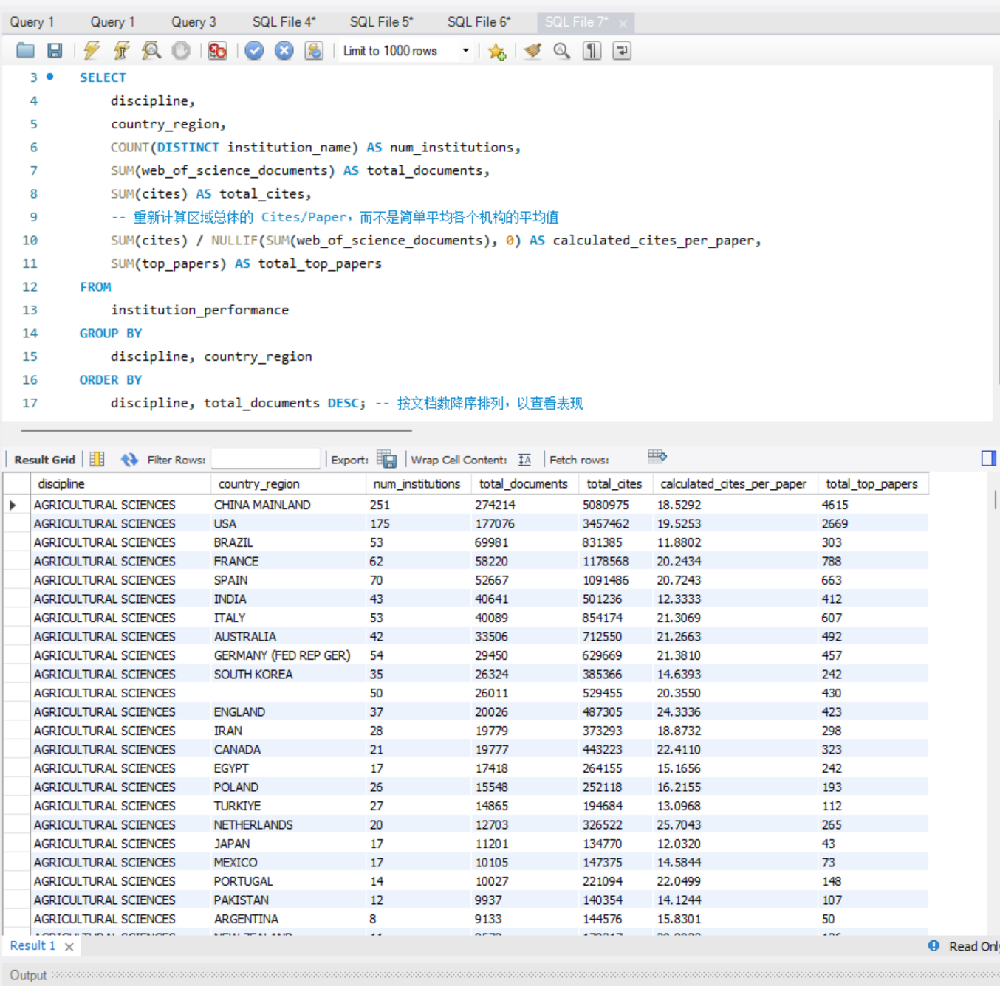

# 7.小结
通过这项作业，我充分了解了什么是Mysql，以及如何去使用他来存储数据，在存储数据的过程中也遇到了很多困难，诸如如何运行、如何对不规范的数据进行预处理等等

也再一次写了SQL的语言，对这个语言的掌握和理解又提升了一步

此外，我觉得从数据科学的角度出发，去引入一些新的变量，比如我刚刚第六部分的 篇均引用量，可以很好的反应该地区在该学科上的表现